[中文](./README.md) &nbsp; | &nbsp; English

<p align="center"></p>
<h1 align="center"> Erupt Framework 🚀 General background management framework </h1>
<h3 align="center">Zero front-end web code, a few lines of Java annotations, get rid of the background management system</h3>

---

[](https://www.erupt.xyz) 
[](./LICENSE) 
[](https://gitee.com/erupt/erupt) 
[](https://gitee.com/erupt/erupt) 
[](https://github.com/erupts/erupt) 
[](https://github.com/erupts/erupt) 


[gitee](https://gitee.com/erupt/erupt) &nbsp; | &nbsp; [github](https://github.com/erupts/erupt) &nbsp; | &nbsp; 
[website](https://www.erupt.xyz) &nbsp; | &nbsp; [document](https://www.yuque.com/yuepeng/erupt) &nbsp; | &nbsp; 
[JavaDoc](https://apidoc.gitee.com/erupt/erupt/) &nbsp; | &nbsp; [Environment Build](https://www.yuque.com/yuepeng/erupt/tpq1l9) &nbsp; | &nbsp; 
[Code](https://www.erupt.xyz/#!/contrast) &nbsp; | &nbsp; [DEMO](https://www.erupt.xyz/demo)

# What erupt
Erupt is a low code all the stack class framework, it USES Java **annotations** to generate the page and add, delete, change, check and back-office functions such as access control, will be simple **Spring Boot** basic knowledge can, don't need to understand the front, also do not need to write tedious CURD, automatically create table structure, the controller/service/SAO/don't have to create mapper file, greatly reduce the development workload, development will be the background faster to the extreme.

> Replace the code generator, the development of background management system better solution!

## Why do you do it ?
Although **code generator** has become the new favorite of background development in recent years, is it really the best solution for background development?
The essence of code Generator is to generate tedious front-end and back-end code. Once the code generated in the later stage is modified, it is difficult to merge. Think of Mybatis-Generator, which is basically a one-time thing.

In most cases, I only want to make a common interface of adding, deleting, modifying and checking for data management, similar to the following:
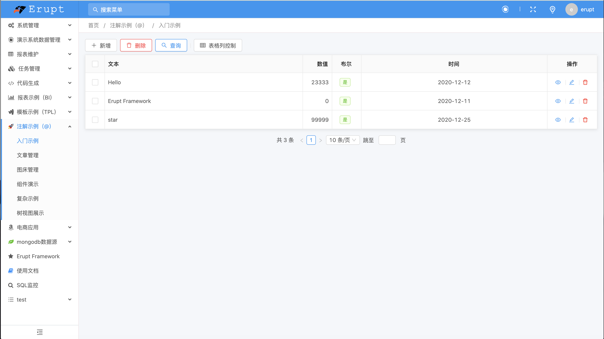
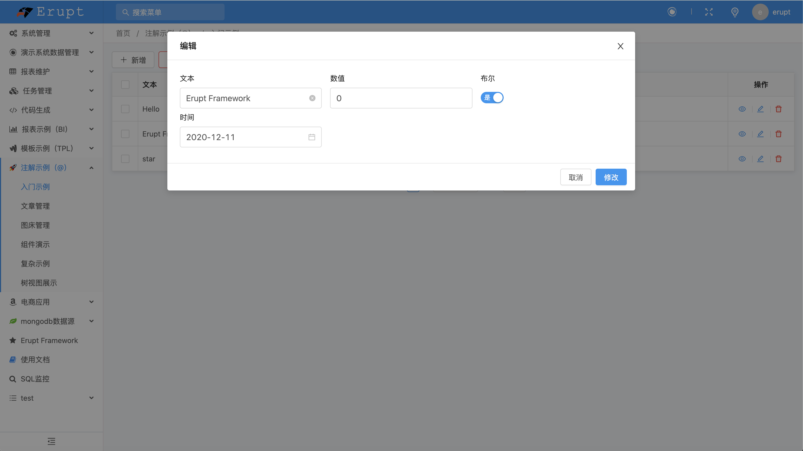

``` java
@Erupt(
       name = "Simple example",
       power = @Power(importable = true, export = true)
)
@Table(name = "t_simple")   //Database table name
@Entity
public class Simple extends BaseModel {

    @EruptField(
            views = @View(title = "textInput"),
            edit = @Edit(title = "textInput", notNull = true, search = @Search)
    )
    private String input;

    @EruptField(
            views = @View(title = "numberInput", sortable = true),
            edit = @Edit(title = "numberInput", search = @Search)
    )
    private Float number;

    @EruptField(
            views = @View(title = "switch"),
            edit = @Edit(title = "switch")
    )
    private Boolean bool;

    @EruptField(
            views = @View(title = "datePicker"),
            edit = @Edit(title = "datePicker", search = @Search(vague = true))
    )
    private Date date;

    @EruptField(
            views = @View(title = "slider"),
            edit = @Edit(title = "slider", type = EditType.SLIDER, search = @Search,
                    sliderType = @SliderType(max = 90, markPoints = {0, 30, 60, 90}, dots = true))
    )
    private Integer slide;

    @EruptField(
            views = @View(title = "choice"),
            edit = @Edit(
                    search = @Search,
                    title = "choice", type = EditType.CHOICE,
                    choiceType = @ChoiceType(fetchHandler = SqlChoiceFetchHandler.class,
                            fetchHandlerParams = "select id,name from e_upms_menu"
                    )
            )
    )
    private Long choice;

}
```
[Functional experience](https://www.erupt.xyz/#!/contrast)

Although this interface can be roughly made with Vue + Ant Design + SSM, a closer look reveals that it has a lot of detailed functions, such as:

+ can filter the data
+ There are buttons to refresh, add and data
+ tables have pagination and summary
+ Preview a single row of data
+ Batch delete
+ hides a column
+ Multiple components
+ sort by some column
+ has a non-null check
+ Supports import and export of Excel

It takes a lot of code to implement all of this just on the front end, not to mention the interfaces and business logic on the back end.

You don't need to know Angular/React/Vue/Jquery or JavaScript/HTML/CSS or even Spring MVC/JPA/Mybatis/SQL to declare. You can guess what most of the configuration will do even if you haven't learned how to declare; all the background page development can be done with simple configuration.

This is the original intention of establishing The Restraint. For most of the commonly used pages, the simplest way should be used. There is no need to learn all kinds of frameworks and tools, so as to focus on the core business and save time to do what you like, instead of being troubled by tedious background development.

## Home
https://www.erupt.xyz

## Intro
+ zero front-end code, only a single file + simple annotation configuration, you can quickly develop enterprise-class Admin management background.
+ Quickly build the full stack solution of enterprise-level middle and back office management system, provide a large number of business components, compress the r&d cycle, reduce the r&d cost.
+ There are certain pain points in the back-end development, such as low development efficiency, unattractive interface, unsatisfactory interaction, repetitive workload, front-end code written by the back-end development, and the code generated by the code generator for the second time cannot be combined, so these problems can be easily resolved.
+ Has a simple and beautiful background page, support 23 types of data entry components, a variety of data source support, strict security policy.
I am not a code generator, and a code generator is not the best solution for background development. The essence of a code generator is to generate cumbersome background code. Once the code is modified, it is difficult to merge the code generated in the later period. Although it alleviates some work, the solution is not the best way.

## Features
+ **Easy to emerge** : Just understand the two annotations of @erupt and @EruptField to get started.
+ **Code is simple** : Front-end zero code, back-end template, Controller, Service, DAO are not needed, only one entity class is needed.
+ **Agile development** : only a single `. Java` file can achieve the background management function, focus on business and core functions of the RESEARCH and development.
+ **Fast iteration** : Requirement changes can be made by simply modifying or adding annotation configurations faster than requirement discussions.
+ **powerful** : dynamic condition processing, support to add, delete, change, check and other functions of proxy interface, Session storage mechanism selection, behavior logging, etc.
+ **High security** : Reliable security mechanism, login whitelist, menu permission authentication, request header check, annotation item check, to protect your data.
+ **Automatic table building** : Relying on JPA can help you do database table building automatically.
+ **Non-invasive** : Does not affect the use of Spring Boot and other module functions at all.
+ **Multiple data sources** : MySQL, Oracle, SQL Server, PostgreSQL, H2, and even MongoDB.
+ **Variety of components** : support sliding input, time selection, switch, picture upload, code editor, auto complete, tree, checkbox, map and other 23 types of components
+ **Rich display** : ordinary text, TWO-DIMENSIONAL code, links, pictures, HTML, code segments, iframe, SWF, etc
+ **Code generation** : Erupt code is concise enough that the code generator can further improve the development efficiency.
+ **Strong scalability** : support custom data source implementation, custom page, custom template, custom attachment upload mechanism, etc.
+ **Beautiful interface** : Each interaction is carefully designed and product thinking is polished for a better operating experience.

## Screenshot
<table>
    <tr>
        <td>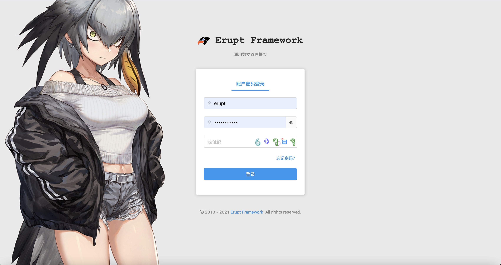</td>
        <td></td>
    </tr>
    <tr>
        <td>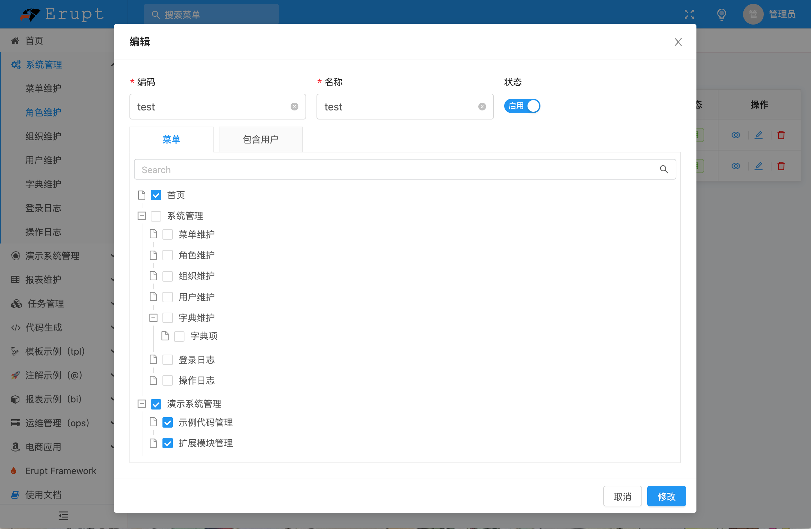</td>
        <td>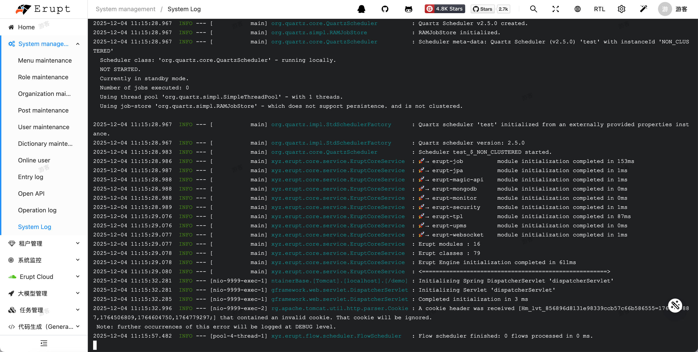</td>
    </tr>
    <tr>
        <td>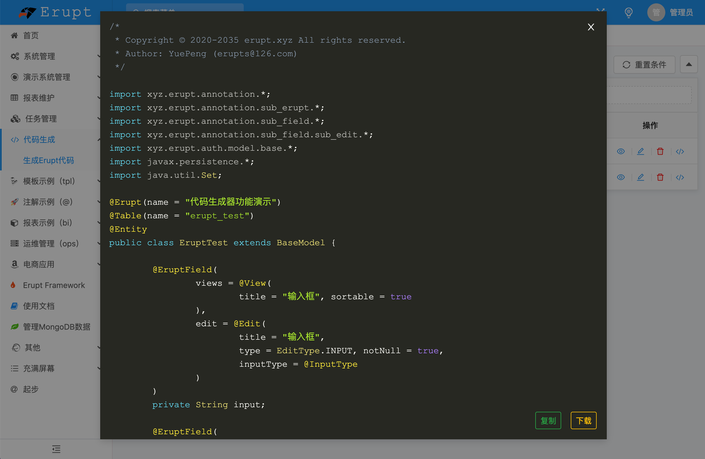</td>
        <td>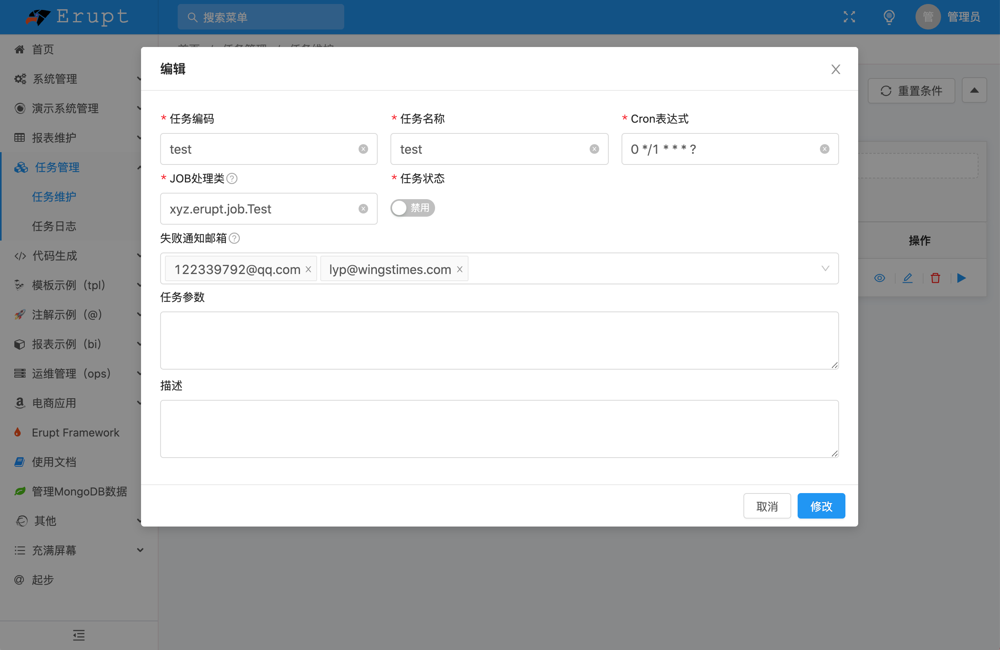</td>
    </tr>
    <tr>
        <td>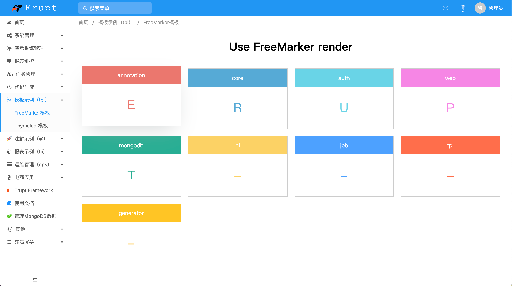</td>
        <td>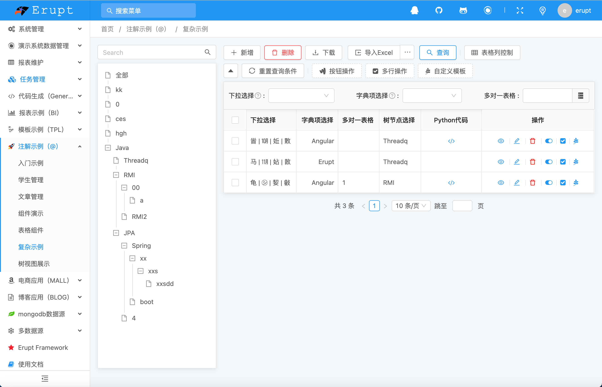</td>
    </tr>
    <tr>
        <td>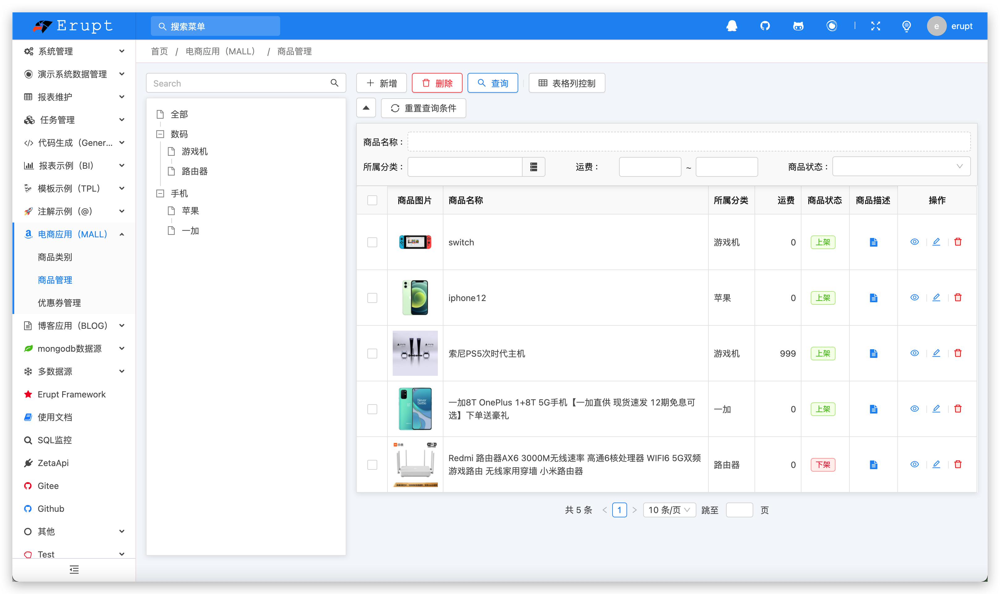</td>
        <td>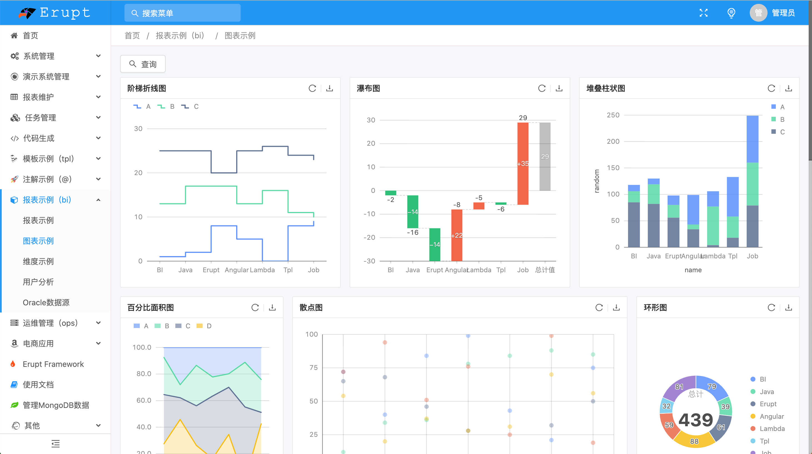</td>
    </tr>
    <tr>
        <td>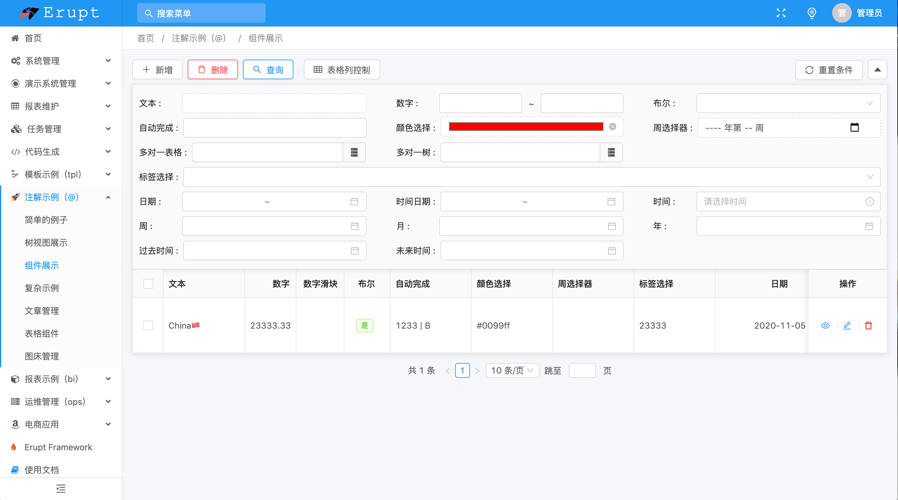</td>
        <td></td>
    </tr>
    <tr>
        <td>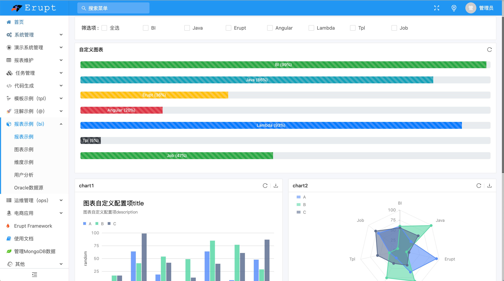</td>
        <td></td>
    </tr>
</table>


## Module
```lua
erupt
├── erupt-annotation -- Core annotation declaration
├── erupt-core -- Core function
├── erupt-data
     ├── erupt-jpa -- jpa erupt impl
     └── erupt-mongodb -- mongodb erupt impl
├── erupt-job -- quartz task
├── erupt-security -- Interface data security
├── erupt-upms -- User Permissions Management System
└── erupt-web -- web ui

erupt-pro //Temporarily not opened
├── erupt-bi -- Business intelligence
├── erupt-tpl -- Supports custom pages, custom charts, custom templates and other functions in restraint，Template engine support：freemarker/thymeleaf/H5
└── erupt-generator -- generator erupt code
```

## Technology system
####  Server：
Java 8、 ScriptEngine、 Annotation、 JDBC、 Reflect、 Spring Boot、 JPA、 Hibernate、 Quartz、 Gson、 Lombok、 Freemarker、 Thymeleaf ...

#### Web：
JavaScript、 H5、 MVVM、 Router、 Angular CLI、 Angular、 NG-ZORRO、 NG-ALAIN、 G2Plot、 RxJS、 TypeScript、 Less ...


##  Demo
Demo site：https://www.erupt.xyz/demo  
Account / pwd：`guest / guest`

**Support 4 major browsers engines, and Internet Explorer 11+ ，Run directly on Electron and other Web standards-based environments**

<table>
    <tr>
        <th width="20%" align="center"> <br> Edge / IE </th>
        <th width="15%" align="center"><br> Firefox </th>
        <th width="15%" align="center"> <br> Chrome </th>
        <th width="15%" align="center"> <br> Safari </th>
        <th width="15%" align="center"> <br> Opera </th>
        <th width="20%" align="center"> <br> Electron </th>
    </tr>
    <tr>
        <td align="center">Edge 16 / IE 11+</td>
        <td align="center">522</td>
        <td align="center">57</td>
        <td align="center">11</td>
        <td align="center">44</td>
        <td align="center">Chromium 57</td>
    </tr>
</table>

## Documentation
https://www.yuque.com/yuepeng/erupt

## Example code
gitee: &nbsp; https://gitee.com/erupt/erupt-example   
github: https://github.com/erupts/erupt-example

## Recommend
[`zeta-api`：Quickly create API interface and document through XML configuration, safe and efficient, rapid development essential！](https://github.com/erupts/zeta-api)

## Donate
Thank you to all our backers! 🙏

**Author**：YuePeng / erupts@126.com