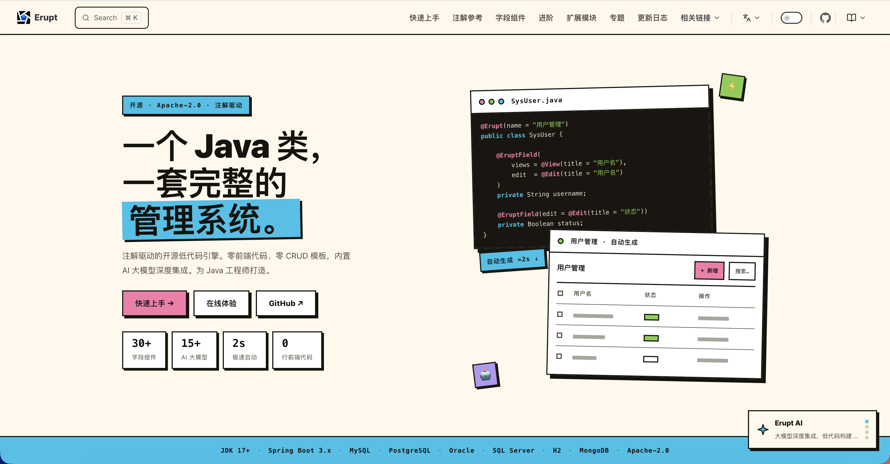

中文 &nbsp;|&nbsp; [English](README.md)

---

<p align="center">
  <picture>
    <source media="(prefers-color-scheme: dark)" srcset="readme/logo2.svg">
    
  </picture>
</p>

<h1 align="center">ERUPT</h1>

<p align="center"><b>注解驱动的 JAVA 管理后台框架 · AI HARNESS</b></p>

<p align="center"><code>一个类 = 一套后台页面 · 零前端 · 2~5s 启动 · 50+ 大模型 · MCP 原生 · A2A</code></p>

<p align="center">
  <a href="https://mvnrepository.com/search?q=erupt"></a>
  <a href="./LICENSE"></a>
  <a href="https://github.com/erupts/erupt"></a>
  <a href="https://github.com/erupts/erupt/releases"></a>
  <a href="https://github.com/erupts/erupt/commits"></a>
  <a href="https://gitee.com/erupt/erupt"></a>
</p>

<p align="center">
  <a href="https://demo.erupt.xyz"><code><b>[ 在线体验 ]</b></code></a>&nbsp;&nbsp;
  <a href="https://start.erupt.xyz"><code><b>[ 创建项目 ]</b></code></a>&nbsp;&nbsp;
  <a href="https://docs.erupt.xyz"><code><b>[ 文档 ]</b></code></a>&nbsp;&nbsp;
  <a href="https://www.erupt.xyz"><code><b>[ 官网 ]</b></code></a>
</p>

---

<p align="center"></p>

---

## 00 · 为什么选 ERUPT

|                  | |
|------------------|---|
| `一个类 = 一套页面`  | 在 JPA 实体上写注解，直接得到完整后台页面。零 Controller、零前端打包、零脚手架。 |
| `极速启动`         | 2~5 秒起一个完整管理后台。Java 17 + Spring Boot 3.x。 |
| `30+ 组件`        | 日期、滑块、树、代码编辑器、参照表格、自动补全、地图、签名、Markdown —— 开箱即用。 |
| `内置全家桶`       | RBAC、审计日志、Excel 导入导出、OpenAPI。每个 `@Erupt` 实体自动是一个带权限的 REST 接口。 |
| `AI NATIVE`      | 50+ 大模型、MCP 原生工具、70 万+ Skills。全部通过管理界面配置。 |
| `多数据库`         | JPA：MySQL · PostgreSQL · Oracle · SQL Server · 达梦。MongoDB 走 `erupt-mongodb`。 |
| `生态`            | `erupt-cloud` 分布式配置。商业模块 Chart / Flow / Tenant / Cube 覆盖报表、工作流、SaaS、BI。 |

---

## 01 · 快速开始

### A — 源码启动

克隆并运行内置示例。内嵌 H2，无需配置。

```bash
git clone https://github.com/erupts/erupt.git
cd erupt
mvn spring-boot:run -pl erupt-sample -am
# → http://localhost:8080   登录：erupt / erupt
```

### B — DOCKER

全家桶镜像 —— [hub.docker.com/r/erupts/erupt](https://hub.docker.com/r/erupts/erupt)。基于 `erupt-spring-boot-starter-all` 构建：designer、job、monitor、magic-api、notice、AI、cloud-server、内嵌 H2。零配置启动。

```bash
docker run -p 8080:8080 erupts/erupt
# → http://localhost:8080   登录：erupt / erupt
```

生产环境：通过 `-e` 环境变量切换 MySQL / Redis —— [镜像使用说明 →](./deploy/erupt-docker/README.md)

### C — MAVEN

**1 · 加一个依赖。**

```xml
<dependency>
    <groupId>xyz.erupt</groupId>
    <artifactId>erupt-spring-boot-starter</artifactId>
    <version>${erupt.version}</version>
</dependency>
```

这一个 starter 已包含跑起来一个 admin 所需的全部依赖（`erupt-admin` + `erupt-web`）。想要全部可选模块（designer、job、generator、monitor、magic-api、websocket、notice、print、terminal、AI、cloud-server）？改用 `erupt-spring-boot-starter-all`。

**2 · 在 JPA 实体上写注解。这就是整个 UI。**

```java
@Erupt(name = "用户")
@Entity
public class User extends BaseModel {

    @EruptField(
        views = @View(title = "姓名"),
        edit  = @Edit(title = "姓名", search = @Search)
    )
    private String name;
}
```

**3 · 启动。**

```bash
mvn spring-boot:run
# → http://localhost:8080   登录：erupt / erupt
```

分页、搜索、导出、行列权限，全都有了。加一个字段，刷新，立刻出现。

> `零安装` —— [demo.erupt.xyz](https://demo.erupt.xyz)（`guest / guest`）
> `起手项目` —— [start.erupt.xyz](https://start.erupt.xyz) 在浏览器里直接生成
> `完整教程` —— [docs.erupt.xyz/guide/quick-start](https://docs.erupt.xyz/guide/quick-start)

<details>
<summary><b>更多 —— 滑块、Choice、自定义按钮、LambdaQuery</b></summary>

```java
@Erupt(
    name = "Simple",
    power = @Power(importable = true, export = true),
    rowOperation = @RowOperation(
        title = "自定义操作",
        mode = RowOperation.Mode.SINGLE,
        operationHandler = OperationHandlerImpl.class
    )
)
@Table(name = "t_simple")
@Entity
public class Simple extends BaseModel {

    @EruptField(
        views = @View(title = "文本"),
        edit  = @Edit(title = "文本", notNull = true, search = @Search)
    )
    private String input;

    @EruptField(
        views = @View(title = "日期"),
        edit  = @Edit(title = "日期", search = @Search)
    )
    private Date date;

    @EruptField(
        views = @View(title = "滑块"),
        edit  = @Edit(title = "滑块", type = EditType.SLIDER, search = @Search,
            sliderType = @SliderType(max = 90, markPoints = {0, 30, 60, 90}, dots = true))
    )
    private Integer slide;

    @EruptField(
        views = @View(title = "选择项"),
        edit  = @Edit(title = "选择项", type = EditType.CHOICE, search = @Search,
            choiceType = @ChoiceType(
                fetchHandler = SqlChoiceFetchHandler.class,
                fetchHandlerParams = "select id, name from e_upms_menu"
            ))
    )
    private Long choice;
}
```

类型安全的 LambdaQuery 链式查询：

```java
List<EruptUser> list = eruptDao.lambdaQuery(EruptUser.class)
        .like(EruptUser::getName, "e")
        .isNull(EruptUser::getWhiteIp)
        .in(EruptUser::getId, 1, 2, 3, 4)
        .ge(EruptUser::getCreateTime, "2023-01-01")
        .list();
```

更多场景 —— [erupt.xyz/#!/contrast](https://www.erupt.xyz/#!/contrast)

</details>

---

## 02 · 开箱即用

| | |
|---|---|
| `UI 自动生成` | 表格、表单、搜索、分页、树视图、甘特图、卡片视图、20+ 表单组件 —— 全部由 `@View` / `@Edit` / `@Search` 驱动。 |
| `权限管控 · UPMS` | 用户、角色、菜单、行级筛选、列级可见性。`@Filter` 上写 SpEL。OAuth2 / LDAP / SSO。 |
| `OPENAPI` | 每个 `@Erupt` 实体自动成为 REST 接口，权限规则与界面完全一致。 |
| `多数据库` | JPA：MySQL · PostgreSQL · Oracle · SQL Server · 达梦。MongoDB 走 `erupt-mongodb`。 |
| `EXCEL` | 导入导出走 `erupt-excel`。自定义就覆盖 `DataProxy` 的 `excelImport` / `excelExport`。 |
| `AI HARNESS` | `erupt-ai` —— 50+ 大模型、MCP 原生工具、内置 RBAC。[→ 03](#03--ai-harness) |
| `AI CLAW` | `erupt-ai-claw` —— 用自然语言驱动实体、Shell、文件、浏览器。[→ 04](#04--ai-claw) |
| `集群` | `erupt-cloud` 分布式配置。商业模块 `erupt-tenant` 提供完整 SaaS。[→ 05](#05--cloud) |

> `该引入哪个 AI 模块？` —— 要原生 LLM / MCP 能力、自己写 agent，选 `erupt-ai`；想直接给 admin 装个开箱即用的 AI 助手，选 `erupt-ai-claw`（已传递依赖 `erupt-ai`，只需引这一个）。

模块列表 —— [erupt.xyz/#!/module](https://www.erupt.xyz/#!/module) · API 文档 —— [javadoc.erupt.xyz](https://javadoc.erupt.xyz)

---

## 03 · AI HARNESS

> `erupt-ai` —— JVM 上的生产级 AI Agent。50+ 大模型 · MCP 原生 · 内置 RBAC · 角色级 system prompt · 会话历史。全部通过管理界面配置。零样板代码。

**为什么叫「HARNESS」** —— 把 AI 推到生产环境，需要的不只是 SDK：**治理**（RBAC）+ **互操作**（MCP）+ **可观测**（会话历史、Token 追踪）+ **运维友好**（管理界面配置）。四件事，一次配齐。

**支持的大模型** —— OpenAI · Claude · Gemini · DeepSeek · 通义千问 · 智谱 GLM · 豆包 · Moonshot · MiniMax · Mistral · Grok · Fireworks · Together · OpenRouter · Requesty · Ollama（本地）—— 管理界面里随时热切换，共 50+ 个。

| | |
|---|---|
| `多模型切换` | 通过管理界面配置多个 LLM。无需修改代码即可切换。 |
| `流式输出 · SSE` | 实时逐 token 响应，可配置超时时间。 |
| `思考模型` | 原生支持推理模型（DeepSeek、Kimi-K2）。 |
| `MCP` | 接入任意 MCP 工具服务器。SSE & STDIO 传输。自动健康检查与重连。 |
| `A2A` | Agent 之间通过标准 A2A 协议互相调用。原生支持多 Agent 协作。 |
| `AI TOOLBOX` | 将任意 Spring Bean 暴露为 AI 工具 —— `@AiToolbox` + `@Tool`。 |
| `TOOL 安全` | 每个 AI 工具都受 `LLMRole` 管控。按角色白名单或回收，运行时生效，无需重启。 |
| `AGENTIC` | 自定义 Agent 的系统提示词、提示词列表、动态 Prompt 处理器，原生集成 MCP 工具。 |
| `会话历史` | 按用户隔离的对话会话，Token 用量追踪，支持软删除。 |
| `长期记忆` | 跨会话记忆持久化。重要决策自动写入记忆，下次会话自动加载。 |

```java
@AiToolbox
@Component
public class MyTools {

    @Tool("根据订单ID查询订单状态")
    public String getOrderStatus(String orderId) {
        return orderService.getStatus(orderId);
    }
}
```

LLM 提供商、MCP 服务器、Agent —— 全部通过内置管理界面配置。无需重启。

---

## 04 · AI CLAW

> `erupt-ai-claw` —— 通过自然语言直接驱动服务器，像与同事对话一样简单。

| | |
|---|---|
| `模型操作` | 通过对话对任意 `@Erupt` 实体进行增删改查。 |
| `SHELL` | 用自然语言直接运行系统命令。 |
| `文件读写` | 读取和写入服务器文件。 |
| `浏览器` | 在 MCP 菜单中添加配置即可与浏览器交互。 |
| `SKILLS · 70 万+` | 兼容 [skills.sh](https://skills.sh) 70 万+ Skills。AI 自动匹配执行。支持动态创建 Skill。 |

Claw 与 AI Harness 共享同一套基于 Role 的 Tool 安全机制 —— 非管理员账号只能调用被白名单的工具。Skills 存放于 `~/.erupt/skills/`，也可在对话中动态创建。

---

## 05 · CLOUD

> `erupt-cloud` —— 把注解驱动的后台体验带到分布式 Spring Boot 部署。集中配置、服务拓扑、节点级后台 —— 同一套 `@Erupt` 模型。

```
┌────────────────────────────┐
│  erupt-cloud-server        │   中心控制台
│  配置 · 节点 · 拓扑          │
└──────────────┬─────────────┘
               │  注册 / 拉取配置
   ┌───────────┼───────────┐
   ▼           ▼           ▼
┌───────┐  ┌───────┐  ┌───────┐
│ node  │  │ node  │  │ node  │   erupt-cloud-node
│ + own │  │ + own │  │ + own │   每个服务自带后台
│ admin │  │ admin │  │ admin │
└───────┘  └───────┘  └───────┘
```

| | |
|---|---|
| `配置中心` | 多维度：配置结构、节点、发布策略。实例按需同步。 |
| `轻依赖` | 对 Spring Boot / 微服务栈侵入极小。版本与 Erupt 主线保持一致。 |
| `拓扑` | 集群拓扑、调用关系、配置发布 —— 一个控制台看全。 |
| `集群内后台` | 每个业务服务都能挂载自己的 Erupt 后台。无需为每个子系统重复搭脚手架。 |
| `审计` | 每次配置变更都有迹可循。比版本级回滚更细粒度。 |

[docs.erupt.xyz/modules/erupt-cloud](https://docs.erupt.xyz/modules/erupt-cloud) · [erupt.xyz/#!/cloud](https://www.erupt.xyz/#!/cloud)

---

## 06 · 商业模块

> `核心永久免费开源` —— `erupt-core` / `erupt-annotation` / `erupt-web` / `erupt-jpa` / `erupt-upms` / `erupt-ai` 等核心模块永久遵循 Apache 2.0 协议。无 License 限制 · 无项目数限制 · 无商用限制（[官方治理承诺 →](./.github/GOVERNANCE.md)）。商业模块是核心之外可选的企业级扩展，与开源核心独立演进。

| 模块 | 用途 | 文档 |
|---|---|---|
| `ERUPT CHART` | 报表图表 / 数据可视化 | [文档 →](https://docs.erupt.xyz/modules/pro/erupt-chart) |
| `ERUPT FLOW` | 流程引擎 / 审批工作流 | [文档 →](https://docs.erupt.xyz/modules/pro/erupt-flow) |
| `ERUPT SAAS` | 多租户基建 | [文档 →](https://docs.erupt.xyz/modules/pro/erupt-tenant) |
| `ERUPT CUBE` | BI 平台（语义层 + 拖拽分析） | [文档 →](https://docs.erupt.xyz/modules/pro/erupt-cube) |

源码交付 · 一次买断 · 永久使用。

**[定价与购买 →](https://www.erupt.xyz/?utm_source=gitee&utm_medium=readme&utm_campaign=pro#!/pro)**

---

## 07 · 参与贡献

免费且开源。提交代码、反馈缺陷、交流想法、分享案例、撰写博客 —— 一切贡献都欢迎。

请先阅读[贡献指南](./.github/CONTRIBUTING.md)，然后提交 [Issue](https://github.com/erupts/erupt/issues) 或 [Pull Request](https://github.com/erupts/erupt/pulls)。

[](https://github.com/erupts/erupt/graphs/contributors)

> `觉得 Erupt 帮到了你？请给个 Star。` 开源不易，对项目成长帮助很大。

<a href="https://www.star-history.com/?repos=erupts%2Ferupt&type=date&legend=top-left" target="_blank">
 <picture>
   <source media="(prefers-color-scheme: dark)" srcset="https://api.star-history.com/image?repos=erupts/erupt&type=date&theme=dark&legend=top-left" />
   <source media="(prefers-color-scheme: light)" srcset="https://api.star-history.com/image?repos=erupts/erupt&type=date&legend=top-left" />
   
 </picture>
</a>

---

## 08 · LICENSE

[Apache 2.0](./LICENSE) —— 免费 · 开源 · 可商用 · 可二次开发。

<p align="right"><code>作者 — <a href="https://github.com/erupts">YuePeng</a> · <a href="mailto:erupts@126.com">erupts@126.com</a></code></p>
