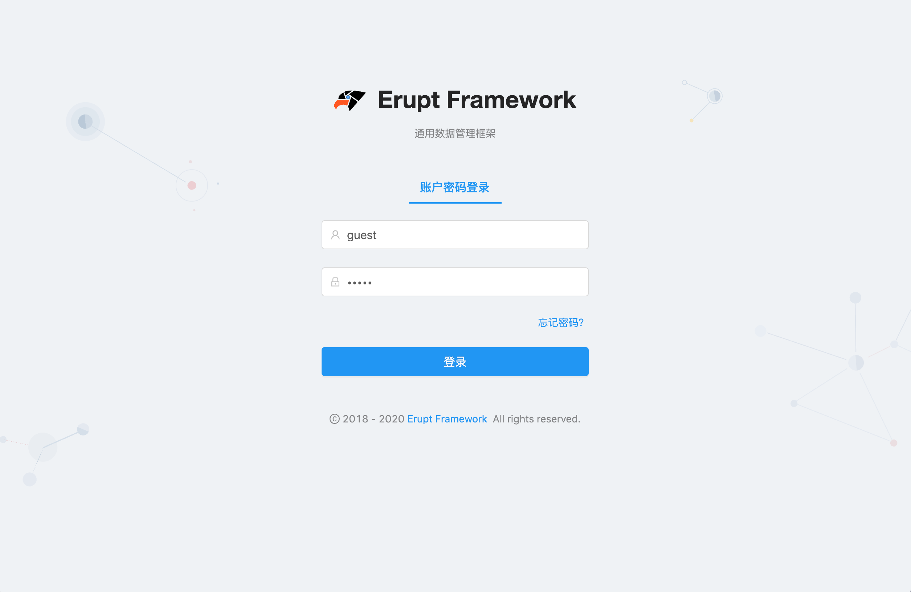
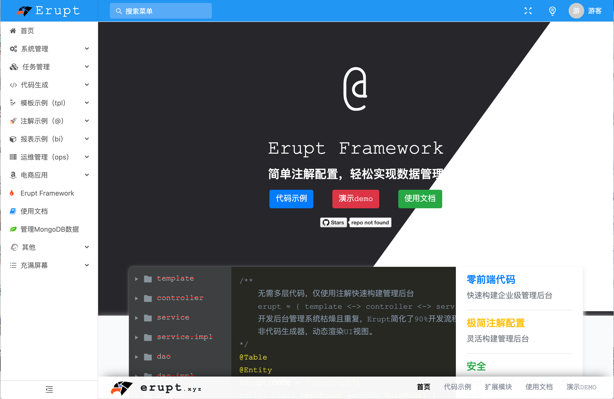
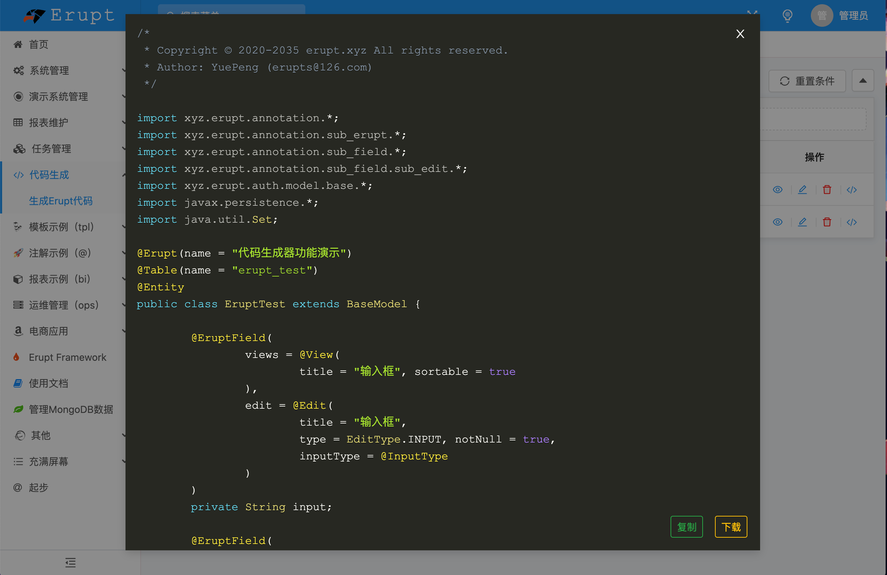
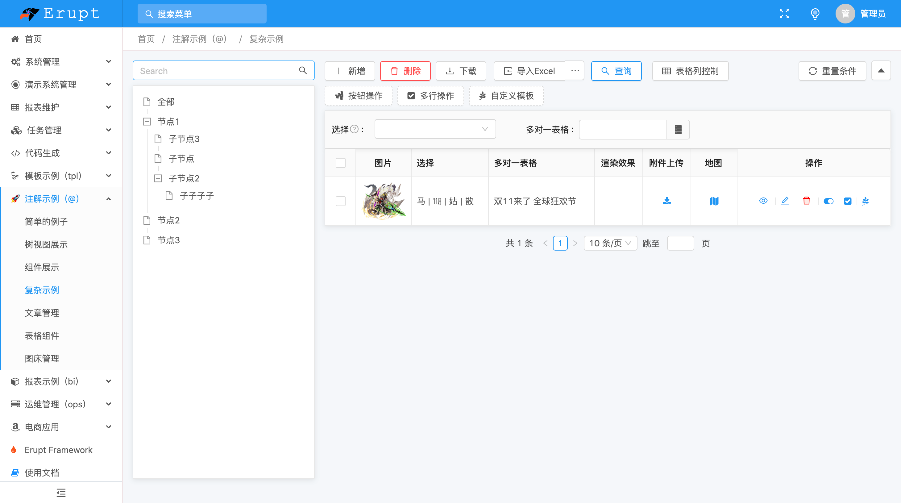
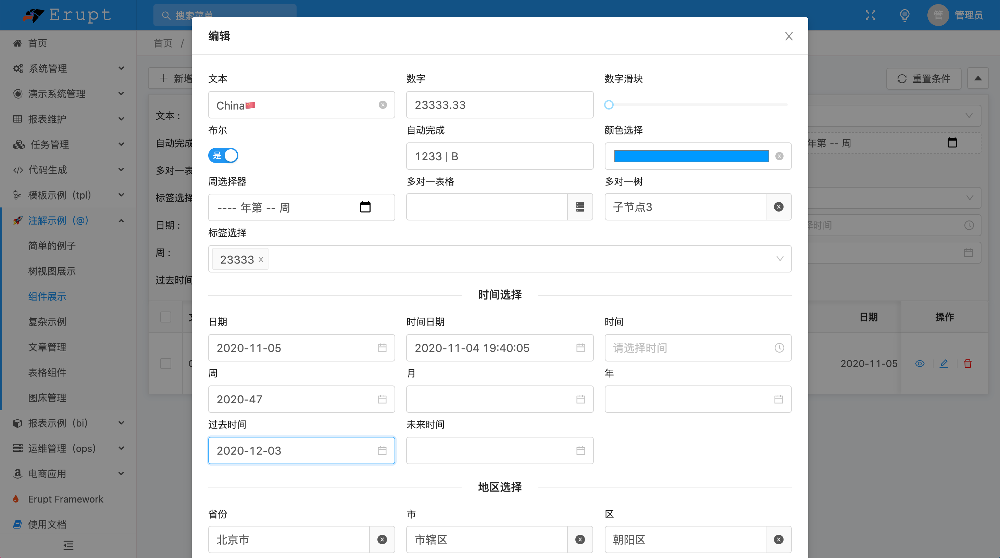
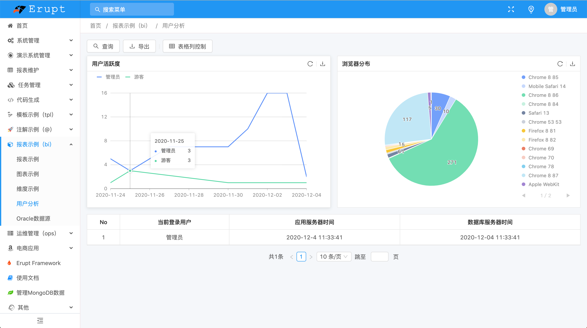

# Erupt Framework 通用数据管理框架

[](https://gitee.com/erupt/erupt)
[](https://github.com/erupts/erupt)
[](https://github.com/erupts/erupt)

国内仓库：https://gitee.com/erupt/erupt

国外仓库：https://github.com/erupts/erupt

QQ交流群：821389129

## 🚀 网站首页
<br/>

https://www.erupt.xyz

## 项目简介
使用Erupt framework可快速构建企业级Admin管理后台，安全高效且无冗余代码。
几分钟就可搭建一个完全可控的管理页面，从此专注核心逻辑的开发。
零前端代码，自动生成数据库表结构，无需编写controller、service、dao、mapper，仅创建实体类与对应注解即可！

### 模块说明

```lua
erupt
├── erupt-annotation -- 核心注解模块
├── erupt-core -- 核心功能包
├── erupt-data -- 数据相关包
     ├── erupt-db -- 关系型数据库erupt实现
     └── erupt-mongodb -- mongodb数据库erupt实现
├── erupt-job -- 定时任务功能
├── erupt-security -- 接口数据安全模块
├── erupt-upms -- 用户权限管理
└── erupt-web -- 前端页面

erupt-pro
├── erupt-bi -- 配置化灵活报表工具，仅需后台配置加sql语句，支持sql与js混编
├── erupt-tpl -- 支持在erupt中自定义页面，自定义图表，自定义模板等功能，模板引擎支持freemarker/thymeleaf/原生H5
└── erupt-generator -- 代码生成器，通过简单配置，生成erupt代码段
```


## 代码示例
``` java
@Erupt(name = "简单的例子")
@Table(name = "simple_table")
@Entity
public class Simple extends BaseModel {

    @EruptField(
            views = @View(title = "文本"),
            edit = @Edit(title = "文本输入")
    )
    private String input;
    
    @EruptField(
            views = @View(title = "数值"),
            edit = @Edit(title = "数值输入")
    )
    private Integer number;

    @EruptField(
            views = @View(title = "布尔"),
            edit = @Edit(title = "布尔选择")
    )
    private Boolean bool;

    @EruptField(
            views = @View(title = "时间"),
            edit = @Edit(title = "时间选择")
    )
    private Date date;

}
```
## 运行效果


## 演示截图
<table>
    <tr>
        <td></td>
        <td></td>
    </tr>
    <tr>
        <td></td>
        <td></td>
    </tr>
    <tr>
        <td></td>
        <td></td>
    </tr>
    <tr>
        <td></td>
        <td></td>
    </tr>
    <tr>
        <td></td>
        <td></td>
    </tr>
    <tr>
        <td></td>
        <td></td>
    </tr>
    <tr>
        <td></td>
        <td></td>
    </tr>
</table>

## 为什么要做Erupt 
+ 开发管理后台是项目中必不可少的工作，但往往管理后台的开发周期要占到实际工作量的50%
+ 开发后台数据管理系统，管理系统页面单一，接口众多，很多后端小伙伴被迫开始接触的前端代码，
+ 本来要需要一个月甚至几个月的工作任务，能否在几小时之内完成呢？
+ 代码生成器的本质还是生成繁琐的后台代码，一旦修改后期生成的代码很难合并，虽然减轻了一部分工作，但仍需更好的解决方式。

## 技术体系
#### 后端  
Java 8、ScriptEngine、Annotation、jdbc、Reflect、Spring Boot、JPA、Hibernate、Quartz、Gson、lombok、freemarker ...

#### 前端  
JavaScript、h5、MVVM、Router、Angular CLI、Angular、NG-ZORRO、NG-ALAIN、G2Plot、RxJS、TypeScript、Less ...

## 演示Demo 
演示地址：https://www.erupt.xyz/demo  
账号密码：`guest / guest`

## 使用文档
https://www.yuque.com/yuepeng/erupt

## 软件著作权
本框架已获得软件著作权，受国家版权局知识产权以及国家计算机软件著作权保护！

## 作者 
YuePeng / erupts@126.com

## 开源推荐
`zeta-api` : 仅需配置XML快速创建api接口与文档，安全且高效，快速开发必备！ https://github.com/erupts/zeta-api

