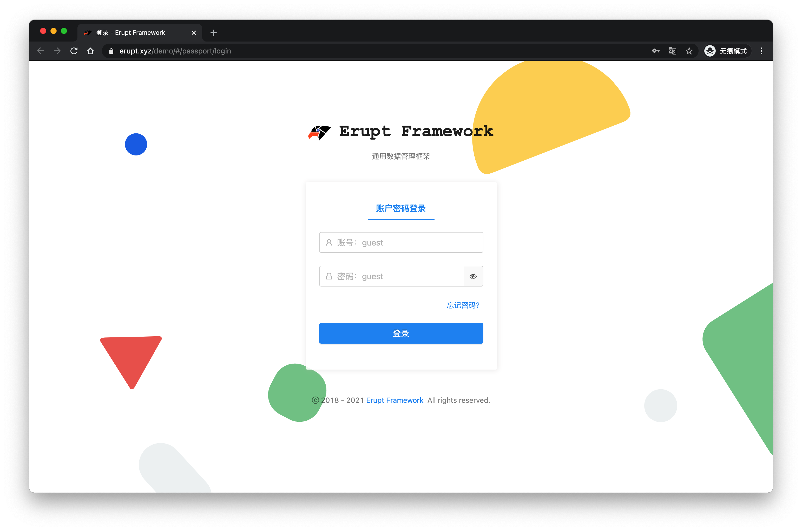
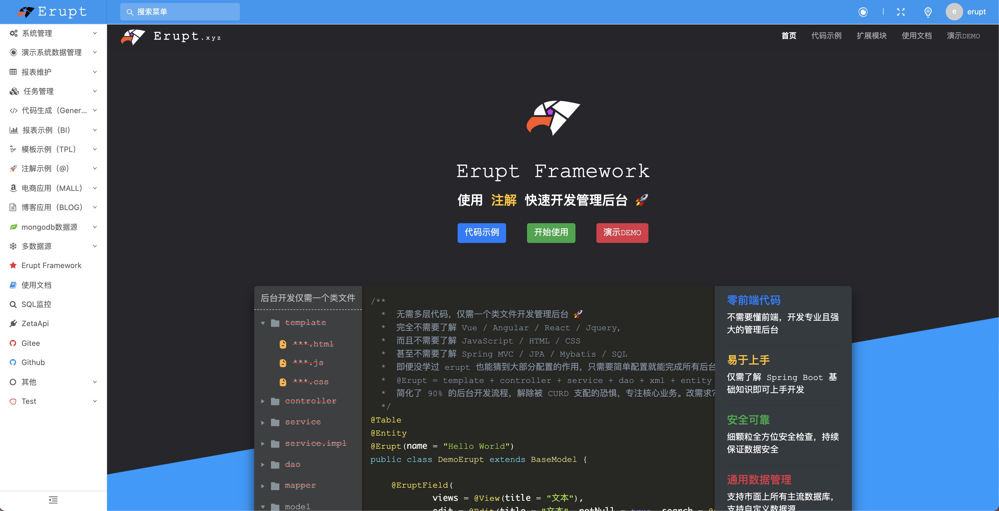
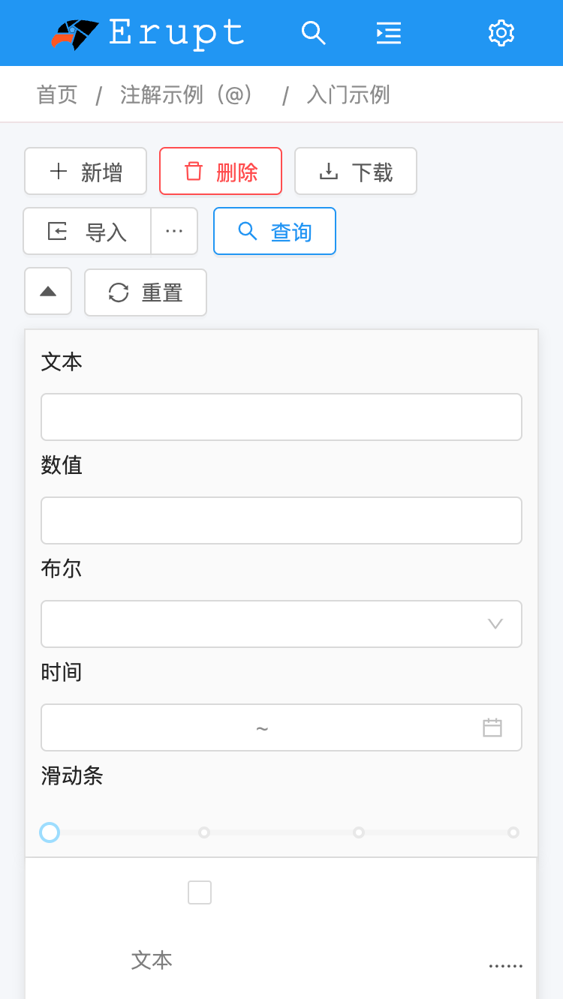
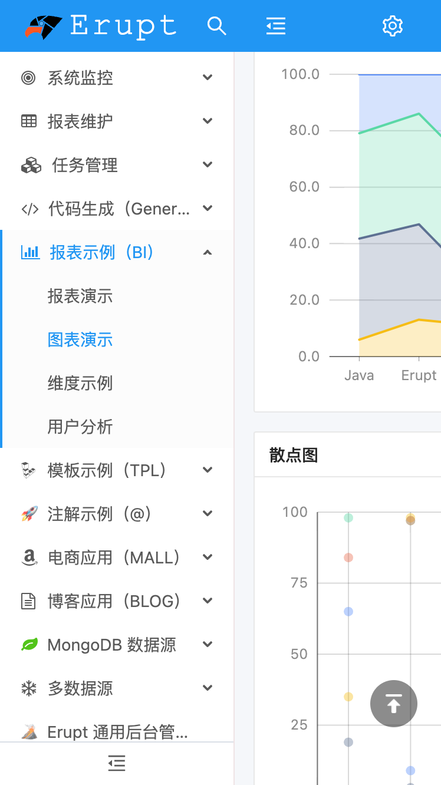
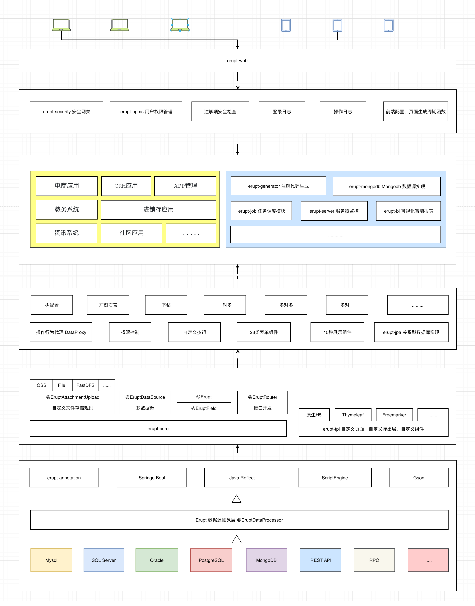

中文 &nbsp; | &nbsp; [English](./README-EN.md)  

<p align="center"></p>
<h1 align="center"> Erupt Framework &nbsp; 🚀 &nbsp; 通用配置管理框架 </h1>
<h3 align="center">零前端代码，急速开发通用管理系统</h3>
<h3 align="center"><a href="https://erupt.xyz" target="_blank">https://www.erupt.xyz</a></h3>

---

<p align="center">
    <a href="https://www.erupt.xyz" target="_blank"></a>
    <a href="https://mvnrepository.com/search?q=erupt"></a>
    <a href="https://www.oracle.com/technetwork/java/javase/downloads/index.html"></a>
    <a href="./LICENSE"></a>
    <a href="https://gitee.com/erupt/erupt"></a>
    <a href="https://gitee.com/erupt/erupt"></a>
    <a href="https://github.com/erupts/erupt"></a>
    <a href="https://github.com/erupts/erupt"></a>
</p>

<p align="center">
    <a href="https://github.com/erupts/erupt">Github 仓库</a> &nbsp; | &nbsp; 
    <a href="https://gitee.com/erupt/erupt">码云仓库</a> &nbsp; | &nbsp; 
    <a href="https://www.erupt.xyz" target="_blank"><b>🦅 官方网站</b></a> &nbsp; | &nbsp; 
    <a href="https://www.erupt.xyz/demo" target="_blank">在线体验</a> &nbsp; | &nbsp; 
    <a href="https://www.erupt.xyz/#!/module" target="_blank">框架生态</a> &nbsp; | &nbsp; 
    <a href="https://www.yuque.com/erupts" target="_blank"><b>📕 使用文档</b></a>
</p>

---

<p align="center">
    <a href="https://www.yuque.com/erupts/erupt/ggbcv9">Erupt Cloud【分布式多维配置中心】</a> &nbsp; | &nbsp; 
    <a href="https://www.yuque.com/erupts/erupt/sd27r9o1pex1s5xn">Erupt Flow 【工作流】</a>
</p>

---

<p align="center">
    QQ交流群：<a href="https://jq.qq.com/?_wv=1027&k=MCd4plZ0">821389129 🔥</a>
</p>

---

## 🚀 简介 | Intro
Erupt 是一个低代码 **全栈类** 框架，它使用 **Java 注解** 动态生成页面以及增、删、改、查、权限控制等后台功能。

零前端代码、零 CURD、自动建表，仅需 **一个类文件** + 简洁的注解配置，快速开发企业级 Admin 管理后台。

高扩展性，支持CURD自由扩展 [@DataProxy](https://www.yuque.com/erupts/erupt/nicqg3) 、自定义数据源、逻辑删除、LDAP、OSS。

提供企业级中后台管理系统的全栈解决方案，大幅压缩研发周期，专注核心业务。

> 完美取代 **代码生成器**，开发后台管理系统更优解！


## 🌈 特性 | Features
+ **自动建表**：表结构自动生成，无需手动建表

+ **易于上手**：会简单的 **Spring Boot** 基础知识即可

+ **使用简单**：仅需了解 **@Erupt** 与 **@EruptField** 两个注解即可上手开发

+ **代码简洁**：仅需一个 `.java` 文件, template、controller、service、dao 都不需要创建

+ **功能强大**：动态条件处理，逻辑删除，LDAP，自定义登录逻辑，RedisSession，操作日志等

+ **多数据源**：支持：MySQL、Oracle、SQL Server、**PostgreSQL**、H2，甚至支持 **MongoDB**

+ **高扩展性**：支持自定义数据源实现、自定义登录逻辑、动态权限管理、生命周期函数、**自定义 OSS**

+ **大量组件**：滑动输入、时间选择、**一对多**、图片上传、代码编辑器、自动完成、树、**多对多**、地图等23类组件

+ **丰富展示**：普通文本、**二维码**、链接、图片、HTML、代码段、iframe、swf等

---

+ **低侵入性**：几乎所有功能都围绕注解而展开，不影响Spring Boot其他功能或三方库库的使用

+ **前后端分离**：后端与前端可分开部署

+ **响应式布局**：支持PC端手机端等各种规格的设备中使用

+ **自定义页面**：支持自定义页面，自定义弹出层，且支持：原生H5 / Freemarker / Thymeleaf等方式渲染

+ **前端零代码**：前端布局自动构建，一行前端代码都不用写

+ **无需二次开发**：仅需引用 jar 包即可 ！

## 🏅 代码仓库 | Git Repository
| |  Github  | 码云 |
|  ---- |  ----  | ----  | 
| 后端源码 | https://github.com/erupts/erupt | https://gitee.com/erupt/erupt |
| 前端源码 | https://github.com/erupts/erupt-web | https://gitee.com/erupt/erupt-web |
| 示例代码 | https://github.com/erupts/erupt-example | https://gitee.com/erupt/erupt-example |

## 🧐 为什么要做 Erupt ?
虽然近些年来 **代码生成器** 成了后台开发的新宠，但它真的是后台开发的最优解吗？

代码生成器的本质还是生成繁琐的前端与后台代码，一旦修改后期生成的代码很难合并，想想 Mybatis-Generator，基本上就是一次性的东西，虽然减轻了部分工作，可解决方式并非最佳。

开发后台管理系统大部分情况下只想做个普通的增删改查界面，用于数据管理，类似下面这种：

PS: erupt支持定义复杂的页面自定义，详见 [erupt-tpl](https://www.yuque.com/erupts/erupt/sgx66o) 模块


``` java
@Erupt(
       name = "简单的例子",
       power = @Power(importable = true, export = true)
)
@Table(name = "t_simple")   //数据库表名
@Entity
public class Simple extends BaseModel {

    @EruptField(
            views = @View(title = "文本"),
            edit = @Edit(title = "文本", notNull = true, search = @Search)
    )
    private String input;

    @EruptField(
            views = @View(title = "数值", sortable = true),
            edit = @Edit(title = "数值", search = @Search)
    )
    private Float number;

    @EruptField(
            views = @View(title = "布尔"),
            edit = @Edit(title = "布尔", search = @Search)
    )
    private Boolean bool;


    @EruptField(
            views = @View(title = "时间"),
            edit = @Edit(title = "时间", search = @Search(vague = true))
    )
    private Date date;

    @EruptField(
            views = @View(title = "滑动条"),
            edit = @Edit(title = "滑动条", type = EditType.SLIDER, search = @Search,
                    sliderType = @SliderType(max = 90, markPoints = {0, 30, 60, 90}, dots = true))
    )
    private Integer slide;

    @EruptField(
            views = @View(title = "下拉选择"),
            edit = @Edit(
                    search = @Search,
                    title = "下拉选择", type = EditType.CHOICE,
                    choiceType = @ChoiceType(fetchHandler = SqlChoiceFetchHandler.class,
                            fetchHandlerParams = "select id,name from e_upms_menu"
                    )
            )
    )
    private Long choice;

}
```

[功能体验](https://www.erupt.xyz/#!/contrast)

这个界面虽然用 Vue + Ant Design + SSM 也能做出个大概，但仔细观察会发现它有大量细节功能如：

+ 有按钮可以查询、新增、批量删除、excel 导入导出
+ 可以对数据做筛选、隐藏某列、按某列排序
+ 表格有分页与汇总，可预览单行数据
+ 多种组件、有校验规则

全部实现这些仅前端就需要大量的代码，后端的接口与业务逻辑更不在少数。

但可以看到，用 erupt 只需要 **30几行** 代码就能完成 ！

> 完全不需要了解 **Angular / React / Vue / Jquery**   
>
> 而且不需要了解 **JavaScript / HTML / CSS**   
>
> 甚至不需要了解 **Spring MVC / Mybatis / SQL**   

即便没学过 erupt 也能猜到大部分配置的作用，只需要简单配置就能完成所有后台页面开发。

这正是建立 erupt 的初衷，对于大部分常用页面，应该使用最简单的方法来实现，甚至不需要学习各种框架和工具，专注核心业务。


## 🆚 开发方式横向比对 | VS
<table>
    <tr>
        <td></td>
        <td>传统 Spring Web 开发</td>
        <td>代码生成器</td>
        <td>Axelor</td>
        <td>Erupt</td>
    </tr>
    <tr>
        <td>领域模型</td>
        <td>Java 代码</td>
        <td>Java 代码</td>
        <td>XML 定义</td>
        <td>Annotation 注解定义</td>
    </tr>
    <tr>
        <td>DTO</td>
        <td>Java 代码</td>
        <td>代码生成</td>
        <td>不需要</td>
        <td>不需要</td>
    </tr>
    <tr>
        <td>ORM 映射</td>
        <td>XML 或 Java 代码</td>
        <td>代码生成</td>
        <td>代码生成</td>
        <td>注解定义</td>
    </tr>
    <tr>
        <td>数据访问</td>
        <td>接口 + 实现</td>
        <td>代码生成</td>
        <td>代码生成</td>
        <td>内置 + 按需实现</td>
    </tr>
    <tr>
        <td>业务逻辑</td>
        <td>接口 + 实现</td>
        <td>代码生成 + 逻辑调整</td>
        <td>内置 + 按需实现</td>
        <td>内置 + 按需 <a href="https://www.yuque.com/erupts/erupt/nicqg3">@DataProxy</a> 实现</td>
    </tr>
    <tr>
        <td>展现层 MVC</td>
        <td>Java 代码 + 视图模板</td>
        <td>代码生成 + 逻辑调整</td>
        <td>不需要</td>
        <td>不需要</td>
    </tr>
    <tr>
        <td>前端</td>
        <td>比 Java 代码还多</td>
        <td>代码生成 + 逻辑调整</td>
        <td>常规应用无需开发</td>
        <td>常规应用无需开发</td>
    </tr>
</table>


## ⛰ 演示截图 | Screenshot
<a href="https://www.erupt.xyz/demo" target="_blank"></a>

<a href="https://www.erupt.xyz" target="_blank"></a>

<a href="https://www.erupt.xyz/demo" target="_blank"></a>
<table>
    <tr>
        <td colspan="2"></td>
        <td colspan="2"></td>
    </tr>
    <tr>
        <td colspan="2"></td>
        <td colspan="2"></td>
    </tr>
    <tr>
        <td colspan="2"></td>
        <td colspan="2"></td>
    </tr>
    <tr>
        <td colspan="2"></td>
        <td colspan="2"></td>
    </tr>
    <tr>
        <td colspan="2"></td>
        <td colspan="2"></td>
    </tr>
    <tr>
        <td colspan="4" align="center">移动端展示效果</td>
    </tr>
    <tr>
        <td></td>
        <td></td>
        <td></td>
        <td></td>
    </tr>
</table>

## 🔗 下载使用 | Download
下载最新的JAR或通过Maven获取。
```xml
<!--用户权限管理-->
<dependency>
  <groupId>xyz.erupt</groupId>
  <artifactId>erupt-upms</artifactId>
  <version>LATEST-VERSION</version>
</dependency>
<!--接口数据安全-->
<dependency>
  <groupId>xyz.erupt</groupId>
  <artifactId>erupt-security</artifactId>
  <version>LATEST-VERSION</version>
</dependency>
<!--后台WEB界面-->
<dependency>
  <groupId>xyz.erupt</groupId>
  <artifactId>erupt-web</artifactId>
  <version>LATEST-VERSION</version>
</dependency>
```

[详细使用步骤](https://www.yuque.com/erupts/erupt/tpq1l9)


## 🥏 模块说明 | Module
```lua
erupt
├── erupt-annotation -- 核心注解声明
├── erupt-core -- 核心功能实现
├── erupt-data -- 数据实现包
     ├── erupt-jpa -- 关系型数据库erupt实现
     └── erupt-mongodb -- mongodb数据库erupt实现
├── erupt-job -- 定时任务功能，支持动态定时任务，邮件发送，任务日志等功能
├── erupt-upms -- 用户权限管理
├── erupt-security -- 接口数据安全
├── erupt-web -- 编译后的前端页面
├── erupt-tpl -- 支持在 erupt 中自定义页面，自定义图表，自定义弹出层，模板引擎支持：FreeMarker / Thymeleaf / 原生H5 / Velocity 等
├── erupt-tpl-ui -- 在 erupt-tpl 中可使用的 UI 库
    ├── ant-design
    ├── element-ui
    └── amis 
├── erupt-generator -- 代码生成器，通过配置，生成 erupt 代码段
└── erupt-monitor -- 基于erupt实现的服务监控

erupt-pro
├── erupt-dataflow -- 基于erupt实现的数据流（构思中）
├── erupt-workflow -- 基于erupt实现的工作流（构思中）
├── erupt-tenant -- 基于erupt实现的SaaS云多租户（开发中，面向企业用户）
└── erupt-bi -- 通过 sql 加 js 混编实现动态报表,支持：多数据源、自定义函数、图表开发等（面向企业用户）

erupt-site -- Erupt 官方网站 https://github.com/erupts/erupt-site

erupt-web -- Erupt 前端源码 https://github.com/erupts/erupt-web

```

## 📟 技术体系 | Technology system
**后端：**
Java 8、 Spring Boot、 ScriptEngine、SpEL、 Annotation、 JDBC、 Reflect、  JPA、 Hibernate、 Quartz、 Gson、 Lombok、 POI ...

**前端：**
JavaScript、 H5、 MVVM、 Router、 Angular CLI、 Angular、 NG-ZORRO、 NG-ALAIN、 G2Plot、 RxJS、 TypeScript、 Less ...

## ⚙️ 架构图 | Framework


## 🌕 在线体验 | Demo
演示地址：[https://www.erupt.xyz/demo](https://www.erupt.xyz/demo)

账号密码：`guest / guest`

**支持主流 4 款现代浏览器，以及 Internet Explorer 11+，可直接运行在 Electron 等基于 Web 标准的环境上**

<table width="100%">
    <tr>
        <th width="20%" align="center"> <br> Edge / IE </th>
        <th width="15%" align="center"><br> Firefox </th>
        <th width="15%" align="center"> <br> Chrome </th>
        <th width="15%" align="center"> <br> Safari </th>
        <th width="15%" align="center"> <br> Opera </th>
        <th width="20%" align="center"> <br> Electron </th>
    </tr>
    <tr>
        <td align="center">Edge 16 / IE 11+</td>
        <td align="center">522</td>
        <td align="center">57</td>
        <td align="center">11</td>
        <td align="center">44</td>
        <td align="center">Chromium 57</td>
    </tr>
</table>

## 🔭 开源推荐 | Recommend
[`zeta-api`：通过XML配置快速创建api接口与文档，安全且高效，快速开发必备！](https://github.com/erupts/zeta-api)  
[`Jpom`：简而轻的低侵入式在线构建、自动部署、日常运维、项目监控软件](https://gitee.com/dromara/Jpom)

## 🧩 加入讨论
QQ交流群：<a href="https://jq.qq.com/?_wv=1027&k=MCd4plZ0">821389129 🔥</a>

由于微信群二维码有效时间仅7日，关注 Erupt 官方公众号（EruptGuide），可获取最新群二维码

## ⛽️ 捐赠 | Donate
此框架服务器，域名，空间，人工等费用一直由作者本人自掏腰包并持续维护，开源不易，一杯咖啡也是爱 🙏

[前往捐赠](https://www.yuque.com/erupts/erupt/mwf15h)

### ⭐️ Erupt 使用 Apache License 2.0 协议，源代码完全开源，无商业限制。 开源不易如果喜欢请给作者 Star 鼓励 👇

---

<p align="center">
    <a href="https://github.com/erupts/erupt">Github 仓库</a> &nbsp; | &nbsp; 
    <a href="https://gitee.com/erupt/erupt">码云仓库</a> &nbsp; | &nbsp; 
    <a href="https://www.erupt.xyz" target="_blank"><b>🦅 官方网站</b></a> &nbsp; | &nbsp; 
    <a href="https://www.erupt.xyz/demo" target="_blank">在线体验</a> &nbsp; | &nbsp; 
    <a href="https://www.yuque.com/erupts" target="_blank">📕 使用文档</a>
</p>

---

<p align="right">
作者 ：YuePeng / <a href="mailto:erupts@126.com">erupts@126.com</a>
</p>
<br>
