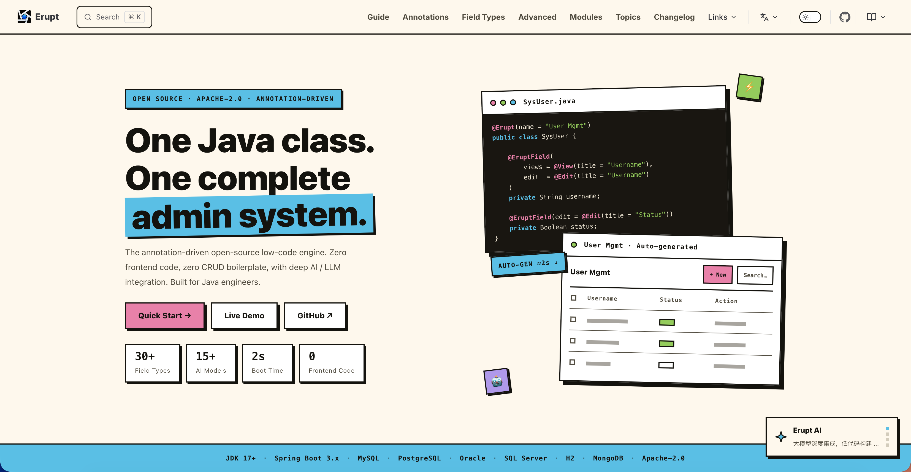

English &nbsp;|&nbsp; [中文](README-zh.md)

---

<p align="center">
  <picture>
    <source media="(prefers-color-scheme: dark)" srcset="readme/logo2.svg">
    
  </picture>
</p>

<h1 align="center">ERUPT</h1>

<p align="center"><b>ANNOTATION-DRIVEN JAVA ADMIN FRAMEWORK · AI HARNESS</b></p>

<p align="center"><code>one class = one admin page · zero front-end · 2–5s startup · 50+ LLM · MCP-native · A2A</code></p>

<p align="center">
  <a href="https://mvnrepository.com/search?q=erupt"></a>
  <a href="./LICENSE"></a>
  <a href="https://github.com/erupts/erupt"></a>
  <a href="https://github.com/erupts/erupt/releases"></a>
  <a href="https://github.com/erupts/erupt/commits"></a>
  <a href="https://gitee.com/erupt/erupt"></a>
</p>

<p align="center">
  <a href="https://www.erupt.xyz"><code><b>[ WEBSITE ]</b></code></a>&nbsp;&nbsp;
  <a href="https://demo.erupt.xyz"><code><b>[ LIVE DEMO ]</b></code></a>&nbsp;&nbsp;
  <a href="https://start.erupt.xyz"><code><b>[ START PROJECT ]</b></code></a>&nbsp;&nbsp;
  <a href="https://docs.erupt.xyz"><code><b>[ DOCS ]</b></code></a>
</p>

---

<p align="center"></p>

---

## 00 · WHY ERUPT

|                        | |
|------------------------|---|
| `ONE CLASS = ONE PAGE` | Annotate a JPA entity. Get a full admin page. Zero controllers, zero front-end build, zero scaffolding. |
| `FAST STARTUP`         | 2–5 seconds to a running admin UI. Java 17 + Spring Boot 3.x. |
| `30+ COMPONENTS`       | Date, slider, tree, code editor, reference table, autocomplete, map, signature, Markdown — out of the box. |
| `BATTERIES INCLUDED`   | RBAC, audit logs, Excel import/export, OpenAPI. Every `@Erupt` entity is a permission-aware REST endpoint. |
| `AI-NATIVE`            | 50+ LLM providers, MCP-native tools, 700k+ skills. All configurable from the admin UI. |
| `MULTI-DATABASE`       | JPA: MySQL · PostgreSQL · Oracle · SQL Server · DM. MongoDB via `erupt-mongodb`. |
| `ECOSYSTEM`            | `erupt-cloud` for distributed config. Commercial Chart / Flow / Tenant / Cube modules for reporting, workflow, SaaS, BI. |

---

## 01 · QUICKSTART

### A — SOURCE

Clone and run the bundled sample. H2 in-memory. No config.

```bash
git clone https://github.com/erupts/erupt.git
cd erupt
mvn spring-boot:run -pl erupt-sample -am
# → http://localhost:8080   login: erupt / erupt
```

### B — DOCKER

All-in-one image — [hub.docker.com/r/erupts/erupt](https://hub.docker.com/r/erupts/erupt). Built on `erupt-spring-boot-starter-all`: designer, job, monitor, magic-api, notice, AI, cloud-server, embedded H2. Zero configuration.

```bash
docker run -p 8080:8080 erupts/erupt
# → http://localhost:8080   login: erupt / erupt
```

Production: switch to MySQL / Redis via `-e` env vars — [image guide →](./deploy/erupt-docker/README.md)

### C — MAVEN

**1 · One dependency.**

```xml
<dependency>
    <groupId>xyz.erupt</groupId>
    <artifactId>erupt-spring-boot-starter</artifactId>
    <version>${erupt.version}</version>
</dependency>
```

Bundles everything a runnable admin needs (`erupt-admin` + `erupt-web`). Want every optional module too (designer, job, generator, monitor, magic-api, websocket, notice, print, terminal, AI, cloud-server)? Use `erupt-spring-boot-starter-all`.

**2 · Annotate a JPA entity. This IS the UI.**

```java
@Erupt(name = "User")
@Entity
public class User extends BaseModel {

    @EruptField(
        views = @View(title = "Name"),
        edit  = @Edit(title = "Name", search = @Search)
    )
    private String name;
}
```

**3 · Run.**

```bash
mvn spring-boot:run
# → http://localhost:8080   login: erupt / erupt
```

Paged. Searchable. Exportable. Role-gated. Add a field, refresh, it shows up.

> `NO INSTALL` — [demo.erupt.xyz](https://demo.erupt.xyz) (`guest / guest`)
> `STARTER` — [start.erupt.xyz](https://start.erupt.xyz) generates a project in your browser
> `FULL GUIDE` — [docs.erupt.xyz/guide/quick-start](https://docs.erupt.xyz/guide/quick-start)

<details>
<summary><b>MORE — sliders, choice fields, custom actions, LambdaQuery</b></summary>

```java
@Erupt(
    name = "Simple",
    power = @Power(importable = true, export = true),
    rowOperation = @RowOperation(
        title = "Custom Action",
        mode = RowOperation.Mode.SINGLE,
        operationHandler = OperationHandlerImpl.class
    )
)
@Table(name = "t_simple")
@Entity
public class Simple extends BaseModel {

    @EruptField(
        views = @View(title = "Text"),
        edit  = @Edit(title = "Text", notNull = true, search = @Search)
    )
    private String input;

    @EruptField(
        views = @View(title = "Date"),
        edit  = @Edit(title = "Date", search = @Search)
    )
    private Date date;

    @EruptField(
        views = @View(title = "Slider"),
        edit  = @Edit(title = "Slider", type = EditType.SLIDER, search = @Search,
            sliderType = @SliderType(max = 90, markPoints = {0, 30, 60, 90}, dots = true))
    )
    private Integer slide;

    @EruptField(
        views = @View(title = "Choice"),
        edit  = @Edit(title = "Choice", type = EditType.CHOICE, search = @Search,
            choiceType = @ChoiceType(
                fetchHandler = SqlChoiceFetchHandler.class,
                fetchHandlerParams = "select id, name from e_upms_menu"
            ))
    )
    private Long choice;
}
```

Type-safe queries with LambdaQuery:

```java
List<EruptUser> list = eruptDao.lambdaQuery(EruptUser.class)
        .like(EruptUser::getName, "e")
        .isNull(EruptUser::getWhiteIp)
        .in(EruptUser::getId, 1, 2, 3, 4)
        .ge(EruptUser::getCreateTime, "2023-01-01")
        .list();
```

More scenarios — [erupt.xyz/#!/contrast](https://www.erupt.xyz/#!/contrast)

</details>

---

## 02 · OUT OF THE BOX

| | |
|---|---|
| `UI GENERATION` | Tables, forms, search, pagination, tree views, Gantt, card views, 20+ field components — driven by `@View` / `@Edit` / `@Search`. |
| `PERMISSIONS · UPMS` | Users, roles, menus, row-level filters, column-level visibility. SpEL on `@Filter`. OAuth2 / LDAP / SSO. |
| `OPENAPI` | Every `@Erupt` entity is a REST endpoint, governed by the same permission rules as the UI. |
| `MULTI-DATABASE` | JPA: MySQL · PostgreSQL · Oracle · SQL Server · DM. MongoDB via `erupt-mongodb`. |
| `EXCEL` | Import/export via `erupt-excel`. Override `excelImport` / `excelExport` on `DataProxy`. |
| `AI HARNESS` | `erupt-ai` — 50+ LLM providers, MCP-native tools, built-in RBAC. [→ 03](#03--ai-harness) |
| `AI CLAW` | `erupt-ai-claw` — drive entities, shell, files, browser through natural language. [→ 04](#04--ai-claw) |
| `CLUSTER` | `erupt-cloud` distributed config. Commercial `erupt-tenant` for full SaaS. [→ 05](#05--cloud) |

> `WHICH AI MODULE?` — Pick `erupt-ai` for raw LLM / MCP access to build your own agent. Pick `erupt-ai-claw` for a turn-key admin agent (it depends on `erupt-ai`; add only this one).

Module catalog — [erupt.xyz/#!/module](https://www.erupt.xyz/#!/module) · API reference — [javadoc.erupt.xyz](https://javadoc.erupt.xyz)

---

## 03 · AI HARNESS

> `erupt-ai` — production-grade AI agents on JVM. 50+ LLM providers · MCP-native · built-in RBAC · role-aware system prompts · chat history. All configurable through the admin UI. Zero boilerplate.

**WHY "HARNESS"** — Shipping AI to production needs more than an SDK: **governance** (RBAC) + **interoperability** (MCP) + **observability** (chat history, token tracking) + **operator-friendly config** (admin UI). All four, out of the box.

**PROVIDERS** — OpenAI · Claude · Gemini · DeepSeek · Qwen · GLM · Doubao · Moonshot · MiniMax · Mistral · Grok · Fireworks · Together · OpenRouter · Requesty · Ollama (self-hosted) — hot-swappable from the admin UI, 50+ total.

| | |
|---|---|
| `MULTI-PROVIDER` | Configure multiple LLMs via UI. Switch without code changes. |
| `STREAMING · SSE` | Token-by-token responses, configurable timeouts. |
| `THINKING MODELS` | Native support for reasoning models (DeepSeek, Kimi-K2). |
| `MCP` | Any MCP-compatible tool server. SSE & STDIO transports. Auto-reconnect health checks. |
| `A2A` | Agents call agents through the standardized A2A protocol. Multi-agent workflows out of the box. |
| `AI TOOLBOX` | Expose any Spring Bean as an AI tool — `@AiToolbox` + `@Tool`. |
| `TOOL SECURITY` | Every AI tool gated by `LLMRole`. Whitelist or revoke per role at runtime. No restart. |
| `AGENTIC` | Agents with custom system prompts, hint lists, dynamic prompt handlers, MCP tools. |
| `CHAT HISTORY` | Per-user sessions, token tracking, soft-delete. |
| `LONG-TERM MEMORY` | Cross-session persistence. Key decisions auto-stored, reloaded next session. |

```java
@AiToolbox
@Component
public class MyTools {

    @Tool("Look up order status by order ID")
    public String getOrderStatus(String orderId) {
        return orderService.getStatus(orderId);
    }
}
```

LLM providers, MCP servers, agents — all managed through the built-in admin UI. No restarts.

---

## 04 · AI CLAW

> `erupt-ai-claw` — drive your server through natural language, like talking to a colleague.

| | |
|---|---|
| `MODEL OPS` | Query, create, update data across any `@Erupt` entity via chat. |
| `SHELL` | Run system commands through natural language. |
| `FILE I/O` | Read and write files on the server. |
| `BROWSER` | Interact with the browser via MCP configuration. |
| `SKILLS · 700K+` | Compatible with 700k+ skills from [skills.sh](https://skills.sh). AI auto-matches and executes. Dynamic skill creation supported. |

Claw shares the same role-based tool security as AI Harness — only whitelisted tools reach non-admin users. Skills live in `~/.erupt/skills/` and can also be created through chat.

---

## 05 · CLOUD

> `erupt-cloud` — the annotation-driven admin experience for distributed Spring Boot deployments. Centralized config, service topology, per-node admin UIs — same `@Erupt` model.

```
┌────────────────────────────┐
│  erupt-cloud-server        │   central console
│  config · nodes · topology │
└──────────────┬─────────────┘
               │  register / pull config
   ┌───────────┼───────────┐
   ▼           ▼           ▼
┌───────┐  ┌───────┐  ┌───────┐
│ node  │  │ node  │  │ node  │   erupt-cloud-node
│ + own │  │ + own │  │ + own │   per-service admin UI
│ admin │  │ admin │  │ admin │
└───────┘  └───────┘  └───────┘
```

| | |
|---|---|
| `CONFIG CENTER` | Multi-dimensional: schemas, nodes, rollout policies. Instances sync on demand. |
| `LIGHT` | Minimal intrusion. Versions aligned with the main Erupt release train. |
| `TOPOLOGY` | Cluster topology, call graphs, config rollouts — one console. |
| `IN-CLUSTER ADMIN` | Every business service hosts its own Erupt admin. No per-subsystem scaffolding. |
| `AUDIT` | Every config change leaves a trace. Finer-grained rollback than version-level. |

[docs.erupt.xyz/modules/erupt-cloud](https://docs.erupt.xyz/modules/erupt-cloud) · [erupt.xyz/#!/cloud](https://www.erupt.xyz/#!/cloud)

---

## 06 · COMMERCIAL MODULES

> `CORE IS FREE, FOREVER` — `erupt-core` / `erupt-annotation` / `erupt-web` / `erupt-jpa` / `erupt-upms` / `erupt-ai` and other core modules are Apache 2.0 forever. No license restrictions · no project-count limits · no commercial restrictions ([governance commitment →](./.github/GOVERNANCE.md)). Commercial modules are optional enterprise extensions that evolve independently.

| MODULE | USE CASE | DOCS |
|---|---|---|
| `ERUPT CHART` | Reports & data visualization | [docs →](https://docs.erupt.xyz/modules/pro/erupt-chart) |
| `ERUPT FLOW` | Workflow / approval engine | [docs →](https://docs.erupt.xyz/modules/pro/erupt-flow) |
| `ERUPT SAAS` | Multi-tenant infrastructure | [docs →](https://docs.erupt.xyz/modules/pro/erupt-tenant) |
| `ERUPT CUBE` | BI platform with semantic layer | [docs →](https://docs.erupt.xyz/modules/pro/erupt-cube) |

Source-code delivery · one-time purchase · perpetual use.

**[PRICING & PURCHASE →](https://www.erupt.xyz/?utm_source=github&utm_medium=readme&utm_campaign=pro#!/pro)**

---

## 07 · CONTRIBUTING

Free and open source. Code, bug reports, ideas, use cases, blog posts — all welcome.

Read the [contribution guidelines](./.github/CONTRIBUTING.md), then open an [issue](https://github.com/erupts/erupt/issues) or [pull request](https://github.com/erupts/erupt/pulls).

[](https://github.com/erupts/erupt/graphs/contributors)

> `IF ERUPT SAVES YOU TIME — STAR IT.` It really helps the project grow.

<a href="https://www.star-history.com/?repos=erupts%2Ferupt&type=date&legend=top-left" target="_blank">
 <picture>
   <source media="(prefers-color-scheme: dark)" srcset="https://api.star-history.com/image?repos=erupts/erupt&type=date&theme=dark&legend=top-left" />
   <source media="(prefers-color-scheme: light)" srcset="https://api.star-history.com/image?repos=erupts/erupt&type=date&legend=top-left" />
   
 </picture>
</a>

---

## 08 · LICENSE

[Apache 2.0](./LICENSE) — free · open source · commercial use permitted · fork-friendly.

<p align="right"><code>AUTHOR — <a href="https://github.com/erupts">YuePeng</a> · <a href="mailto:erupts@126.com">erupts@126.com</a></code></p>
