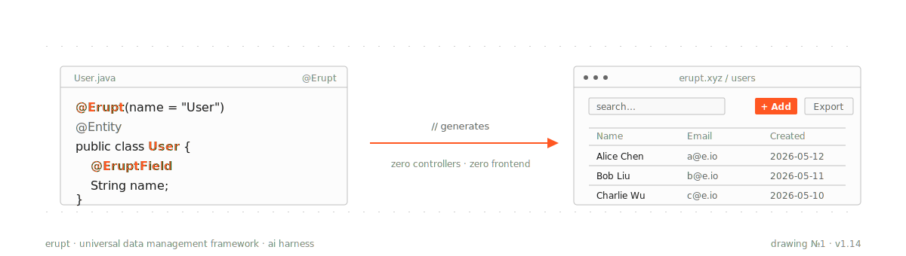

English &nbsp; | &nbsp; [中文](README-zh.md)

---

<p align="center">
  <picture>
    <source media="(prefers-color-scheme: dark)" srcset="readme/logo2.svg">
    
  </picture>
</p>

<h1 align="center">Erupt · Annotation-Driven Java Admin Framework</h1>

<h3 align="center">AI Harness · 50+ LLM providers · MCP-native · A2A protocol</h3>

<p align="center">
  Java annotations · Spring Boot 3 · zero front-end · 2–5s startup
</p>

---

<p align="center">
  <a href="https://mvnrepository.com/search?q=erupt" target="_blank"></a>
  <a href="./LICENSE"></a>
  <a href="https://github.com/erupts/erupt"></a>
  <a href="https://github.com/erupts/erupt"></a>
  <a href="https://gitcode.com/erupts/erupt" target="_blank"></a>
  <a href="https://gitee.com/erupt/erupt" target="_blank"></a>
  <a href="https://gitee.com/erupt/erupt" target="_blank"></a>
  <a href="https://github.com/erupts/erupt/commits"></a>
  <a href="https://github.com/erupts/erupt/releases"></a>
  <a href="https://github.com/erupts/erupt/discussions"></a>
</p>

---

<p align="center">
  <a href="https://demo.erupt.xyz" target="_blank"></a>
  &nbsp;
  <a href="https://start.erupt.xyz" target="_blank"></a>
  &nbsp;
  <a href="https://docs.erupt.xyz" target="_blank"></a>
  &nbsp;
  <a href="https://www.erupt.xyz" target="_blank"></a>
</p>

---

<p align="center"></p>

[//]: # (<p align="center"></p>)

---

## 💡 Why Erupt?

- **One class file = a full admin page.** Zero controllers, zero front-end build, zero scaffolding.
- **Lightning startup.** 2–5 seconds to a running admin UI on Java 17 + Spring Boot 3.x.
- **20+ field components** out of the box: date, slider, tree, code editor, reference table, autocomplete, map, signature, Markdown…
- **Built-in RBAC, audit logs, Excel import/export, OpenAPI** — every `@Erupt` entity is automatically a permission-aware REST endpoint.
- **AI-Native.** 50+ LLM providers, MCP-native tools, 700k+ skills, all configurable from the admin UI.
- **Multi-database.** JPA by default (MySQL · PostgreSQL · Oracle · SQL Server · DM); MongoDB via `erupt-mongodb`.
- **Production-ready ecosystem.** `erupt-cloud` for distributed config; commercial Chart / Flow / Tenant / Cube modules cover reporting, workflow, multi-tenant SaaS, and semantic-layer BI.

---

## ⚡ 60-second quickstart

https://github.com/user-attachments/assets/aa348010-a894-4b3e-9217-a30fd3acadfa

### 1. Add two dependencies

```xml
<dependency>
    <groupId>xyz.erupt</groupId>
    <artifactId>erupt-admin</artifactId>
    <version>${erupt.version}</version>
</dependency>
<dependency>
    <groupId>xyz.erupt</groupId>
    <artifactId>erupt-web</artifactId>
    <version>${erupt.version}</version>
</dependency>
```

### 2. Annotate a JPA entity — this **is** the UI

```java
@Erupt(name = "User")
@Entity
public class User extends BaseModel {

    @EruptField(
        views = @View(title = "Name"),
        edit  = @Edit(title = "Name", search = @Search)
    )
    private String name;
}
```

### 3. Run and login

```bash
mvn spring-boot:run
# → http://localhost:8080   login: erupt / erupt
```

You now have a paged, searchable, exportable admin page with role-based permissions — backed by the table behind `User`. Add a field, refresh, it shows up.

> Don't want to clone? Try **[demo.erupt.xyz](https://demo.erupt.xyz)** (`guest / guest`).
> Want a starter project? **[start.erupt.xyz](https://start.erupt.xyz)** generates one in your browser.
> Prefer to run from source? Clone this repo and run `EruptSampleApplication` in the `erupt-sample` module — bundled H2 database, no extra config required.
> Need the full walkthrough? **[Detailed setup guide →](https://docs.erupt.xyz/guide/quick-start)**

<details>
<summary><b>📦 Show me a richer example — sliders, choice fields, custom actions, LambdaQuery</b></summary>

```java
@Erupt(
    name = "Simple",
    power = @Power(importable = true, export = true),
    rowOperation = @RowOperation(
        title = "Custom Action",
        mode = RowOperation.Mode.SINGLE,
        operationHandler = OperationHandlerImpl.class
    )
)
@Table(name = "t_simple")
@Entity
public class Simple extends BaseModel {

    @EruptField(
        views = @View(title = "Text"),
        edit  = @Edit(title = "Text", notNull = true, search = @Search)
    )
    private String input;

    @EruptField(
        views = @View(title = "Date"),
        edit  = @Edit(title = "Date", search = @Search)
    )
    private Date date;

    @EruptField(
        views = @View(title = "Slider"),
        edit  = @Edit(title = "Slider", type = EditType.SLIDER, search = @Search,
            sliderType = @SliderType(max = 90, markPoints = {0, 30, 60, 90}, dots = true))
    )
    private Integer slide;

    @EruptField(
        views = @View(title = "Choice"),
        edit  = @Edit(title = "Choice", type = EditType.CHOICE, search = @Search,
            choiceType = @ChoiceType(
                fetchHandler = SqlChoiceFetchHandler.class,
                fetchHandlerParams = "select id, name from e_upms_menu"
            ))
    )
    private Long choice;
}
```

**Type-safe queries with LambdaQuery:**

```java
List<EruptUser> list = eruptDao.lambdaQuery(EruptUser.class)
        .like(EruptUser::getName, "e")
        .isNull(EruptUser::getWhiteIp)
        .in(EruptUser::getId, 1, 2, 3, 4)
        .ge(EruptUser::getCreateTime, "2023-01-01")
        .list();
```

More scenarios: **[erupt.xyz/#!/contrast](https://www.erupt.xyz/#!/contrast)**

</details>

---

## 📦 What you get out of the box

<table>
  <tr>
    <td width="50%" valign="top">

**🧱 UI generation**
Tables, forms, search, pagination, tree views, Gantt charts, card views, 20+ field components — all driven by `@View`, `@Edit`, `@Search` on each field.

**🔐 Permissions (UPMS)**
Users, roles, menus, row-level filters, column-level visibility. SpEL expressions on `@Filter` for dynamic rules. OAuth2 / LDAP / SSO supported.

**🌐 OpenAPI exposure**
Every `@Erupt` entity is automatically a REST endpoint, governed by the same permission rules as the UI.

**🗄️ Multi-database**
JPA by default (MySQL · PostgreSQL · Oracle · SQL Server · DM …); MongoDB via `erupt-mongodb`.

  </td>
  <td width="50%" valign="top">

**📊 Excel import & export**
Built-in via `erupt-excel`. Override `excelImport` / `excelExport` on `DataProxy` to customize.

**🐴 AI Harness (`erupt-ai`)**
50+ LLM providers, MCP-native tools, all configurable from the admin UI with built-in RBAC. [→ details below](#-erupt-ai-harness--production-grade-ai-agents-on-jvm)

**🦞 AI Claw (`erupt-ai-claw`)**
Drive Erupt entities, the shell, files, and a browser through natural language. [→ details below](#-erupt-ai-claw)

> **Which one do I add?** Pick **`erupt-ai`** if you want raw LLM / MCP access to build your own agent; pick **`erupt-ai-claw`** if you want a turn-key admin agent out of the box (it depends on `erupt-ai`, so you only need this one).

**☁️ Cluster & multi-tenant**
`erupt-cloud` for distributed config; commercial `erupt-tenant` for full SaaS.

  </td>
  </tr>
</table>

Full module catalog: **[erupt.xyz/#!/module](https://www.erupt.xyz/#!/module)** &nbsp;·&nbsp; API reference: **[javadoc.erupt.xyz](https://javadoc.erupt.xyz)**

---

## 🐴 Erupt AI Harness · Production-grade AI Agents on JVM

> `erupt-ai` is the **AI Harness** for Spring Boot: 50+ LLM providers · MCP-native tools · built-in **RBAC** · role-aware system prompts · chat history — all configurable through the admin UI, zero boilerplate.

**Why "Harness"?** Shipping AI to production needs more than an SDK — it needs **governance** (RBAC), **interoperability** (MCP), **observability** (chat history + token tracking), and **operator-friendly config** (admin UI). Erupt AI Harness gives all four out of the box.

### Supported LLM providers

OpenAI · Claude · Gemini · DeepSeek · Qwen · GLM · Doubao · Moonshot · MiniMax · Mistral · Grok · Fireworks · Together · OpenRouter · Requesty · Ollama (self-hosted) — **hot-swappable from the admin UI, 50+ in total.**

### Key capabilities

- **Multi-provider switching** — configure multiple LLMs via UI, switch without code changes
- **Streaming chat (SSE)** — real-time token-by-token responses with configurable timeouts
- **Thinking models** — native support for reasoning models (DeepSeek, Kimi-K2)
- **MCP protocol** — connect any MCP-compatible tool server (SSE & STDIO transports), auto-reconnect health checks
- **A2A protocol (Agent-to-Agent)** — agents call other agents through the standardized A2A protocol; multi-agent workflows out of the box
- **AI Toolbox** — expose any Spring Bean as an AI tool via `@AiToolbox` + `@Tool` annotations
- **Tool security · dynamic Role control** — every AI tool is gated by `LLMRole`; whitelist or revoke per role at runtime, no restart
- **Agentic AI framework** — define agents with custom system prompts, hint lists, dynamic prompt handlers, MCP tool integration
- **Chat history** — per-user conversation sessions with token tracking and soft-delete
- **Long-term memory** — cross-session memory persistence; AI automatically stores key decisions and context, reloaded next session

### AI Toolbox example

```java
@AiToolbox
@Component
public class MyTools {

    @Tool("Look up order status by order ID")
    public String getOrderStatus(String orderId) {
        return orderService.getStatus(orderId);
    }
}
```

LLM providers, MCP servers, and agents are all managed through the built-in admin UI — no restarts required.

---

## 🦞 Erupt AI Claw

> Drive your server through natural language — just like talking to a colleague.

Erupt AI Claw lets you control annotation-driven data & business logic, execute shell commands, read/write files, and extend custom Skills — all through conversational AI.

### Claw capabilities

- **Erupt model operations** — query, create, update data across any `@Erupt` entity via chat
- **Shell execution** — run system commands directly through natural language
- **File I/O** — read and write files on the server
- **Browser control** — interact with the browser via MCP configuration
- **Skills (700k+)** — compatible with 700k+ skills from [skills.sh](https://skills.sh); AI auto-matches and executes the right skill; supports dynamic skill creation

Claw shares the same Role-based Tool security as AI Harness — only whitelisted tools are exposed to non-admin users. Skills are stored in `~/.erupt/skills/` and can also be created dynamically through chat.

---

## ☁️ Erupt Cloud · Distributed config & multi-node admin

> `erupt-cloud` brings the annotation-driven admin experience to distributed Spring Boot deployments — centralized config, service topology, and per-node admin UIs, all under the same `@Erupt` model.

### Architecture

- **`erupt-cloud-server`** — central console for cluster-wide config and node management
- **`erupt-cloud-node`** — drop-in dependency each service uses to register itself and pull config

### Key capabilities

- **Multi-dimensional config center** — centrally maintain config schemas, nodes, and rollout policies; instances sync on demand
- **Light dependencies** — minimal intrusion into your Spring Boot / microservices stack; versions stay aligned with the main Erupt release train
- **Nodes & topology** — visualize cluster topology, call graphs, and config rollouts in a single console
- **In-cluster admin UIs** — every business service can host its own Erupt admin without rebuilding scaffolding per subsystem
- **Audit-friendly** — every config change leaves a trace; finer-grained rollback than version-level rollback

[→ Erupt Cloud docs](https://docs.erupt.xyz/modules/erupt-cloud) &nbsp;·&nbsp; [erupt.xyz/#!/cloud](https://www.erupt.xyz/#!/cloud)

---

> 📌 **Core modules are permanently free and open source** — `erupt-core` / `erupt-annotation` / `erupt-web` / `erupt-jpa` / `erupt-upms` / `erupt-ai` and other core modules are licensed under Apache 2.0 forever — **no License restrictions · no project-count limits · no commercial restrictions** (see the [governance commitment →](./.github/GOVERNANCE.md)). The commercial modules below are optional enterprise extensions that evolve independently from the open-source core.

## 🔌 Commercial extension modules

Beyond the open-source core, 4 enterprise-grade modules are available — source-code delivery · one-time purchase · no License / project-count / commercial restrictions:

| Module | Use case | Documentation |
| --- | --- | --- |
| **Erupt Chart** | Reports & data visualization | [📖 Docs](https://docs.erupt.xyz/modules/pro/erupt-chart) |
| **Erupt Flow** | Workflow / approval engine | [📖 Docs](https://docs.erupt.xyz/modules/pro/erupt-flow) |
| **Erupt SaaS** | Multi-tenant infrastructure | [📖 Docs](https://docs.erupt.xyz/modules/pro/erupt-tenant) |
| **Erupt Cube** | BI platform with semantic layer | [📖 Docs](https://docs.erupt.xyz/modules/pro/erupt-cube) |

*Source-code delivery · one-time purchase · perpetual use · evolves independently from the open-source core.*

👉 **[See pricing and purchase process →](https://www.erupt.xyz/?utm_source=github&utm_medium=readme&utm_campaign=pro#!/pro)**

---

## 🤝 Contributing

Erupt is a free and open-source project. We welcome anyone to contribute — submitting code, reporting bugs, sharing ideas, or sharing your use cases. Blog posts and social-media coverage are equally welcome.

To contribute code, please read our [contribution guidelines](./.github/CONTRIBUTING.md) first, then open an [Issue](https://github.com/erupts/erupt/issues) or [Pull Request](https://github.com/erupts/erupt/pulls) on GitHub.

**Thanks to the following contributors:**

[](https://github.com/erupts/erupt/graphs/contributors)

> ⭐ **If Erupt saves you time, please star us on GitHub — it really helps the project grow.**

---

## ⭐ Star history

<a href="https://www.star-history.com/?repos=erupts%2Ferupt&type=date&legend=top-left" target="_blank">
 <picture>
   <source media="(prefers-color-scheme: dark)" srcset="https://api.star-history.com/image?repos=erupts/erupt&type=date&theme=dark&legend=top-left" />
   <source media="(prefers-color-scheme: light)" srcset="https://api.star-history.com/image?repos=erupts/erupt&type=date&legend=top-left" />
   
 </picture>
</a>

---

## 📄 License

Erupt is licensed under [Apache 2.0](./LICENSE) — free, open source, commercial use permitted, fork-friendly.

<p align="right">
  Author: <a href="https://github.com/erupts">YuePeng</a> &nbsp;·&nbsp; <a href="mailto:erupts@126.com">erupts@126.com</a>
</p>
