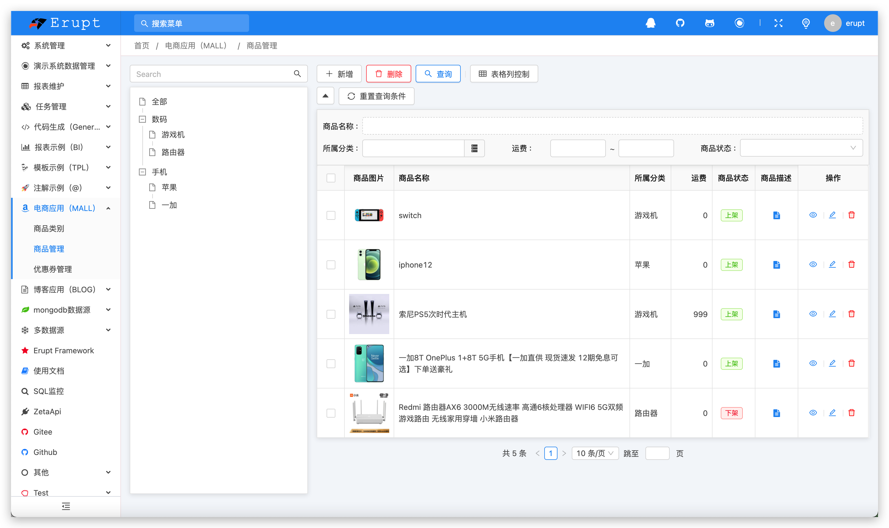
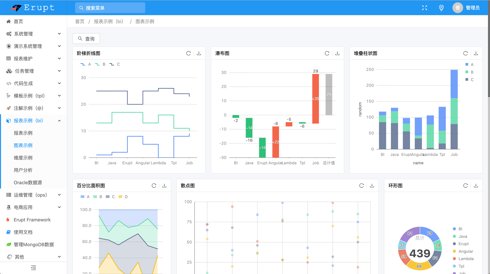
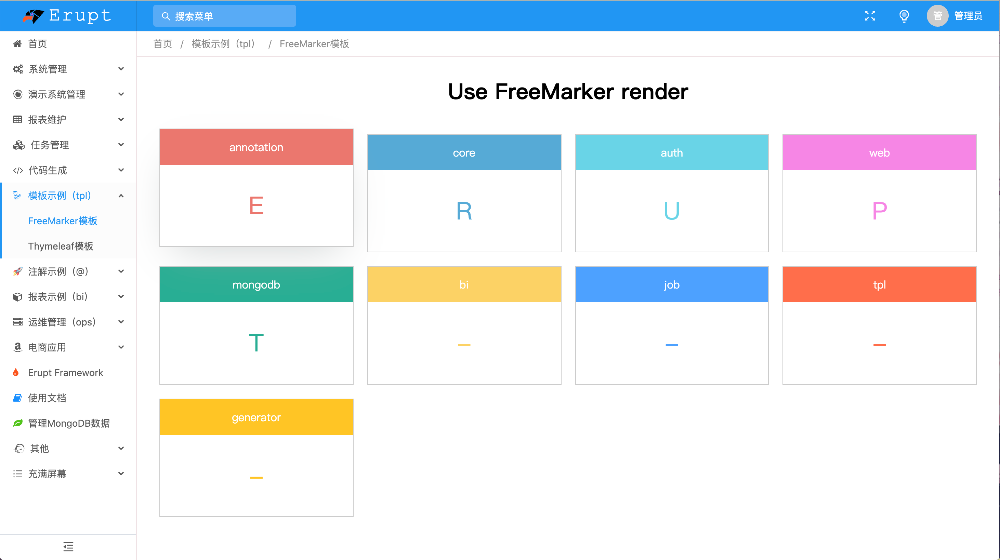
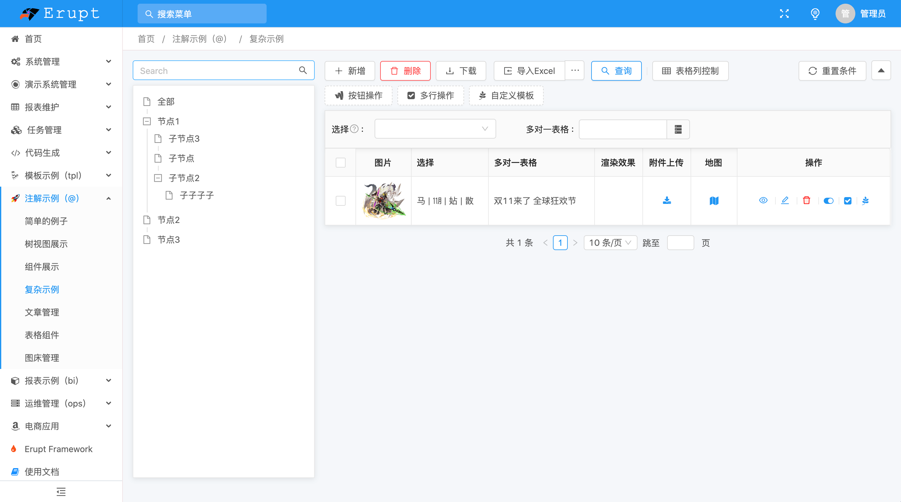
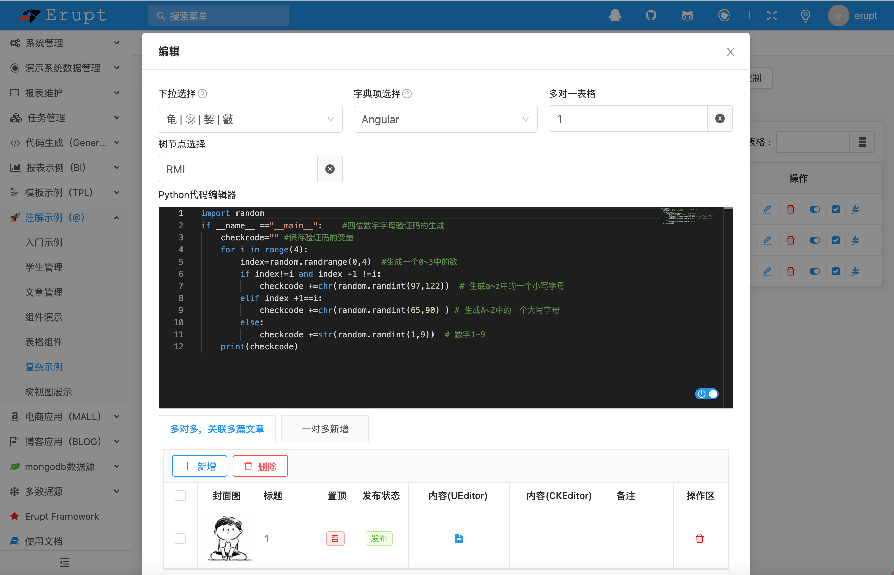
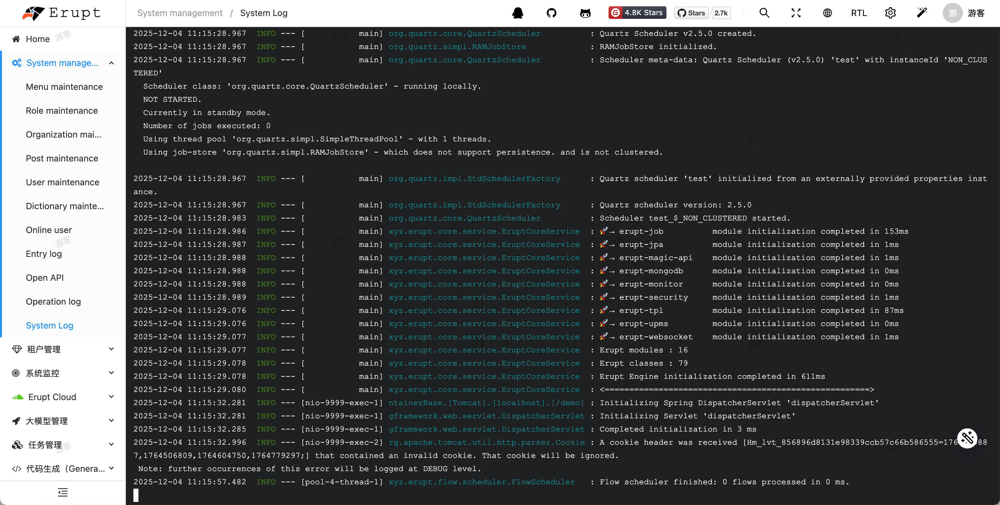
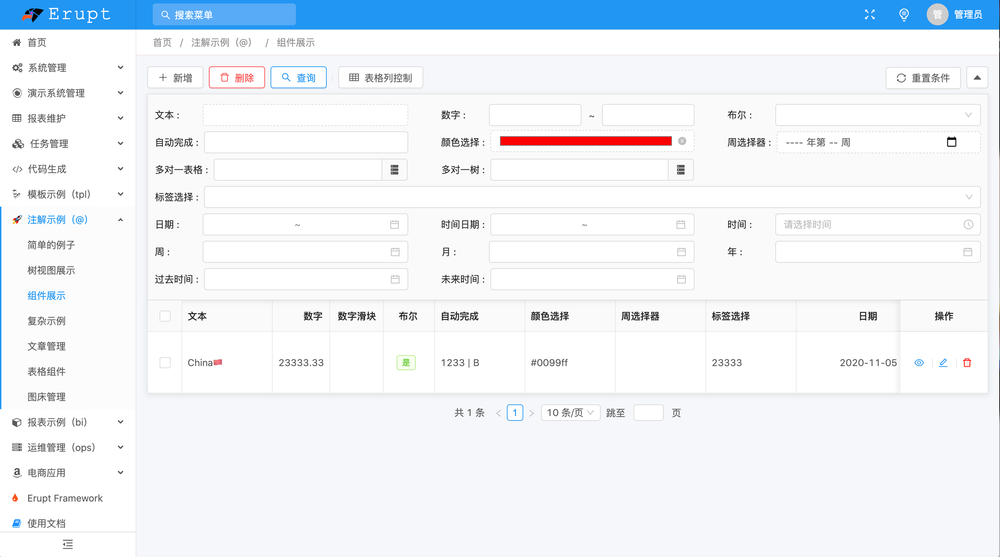
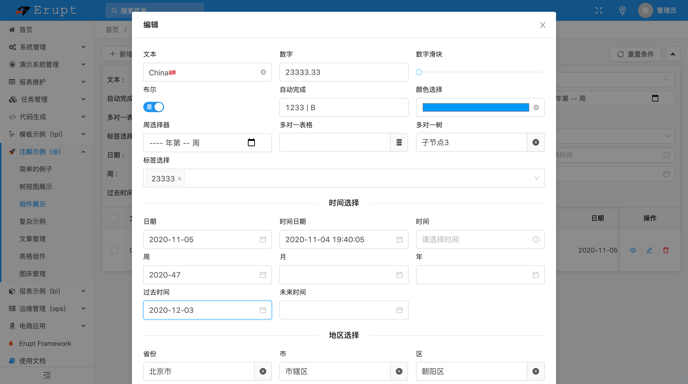
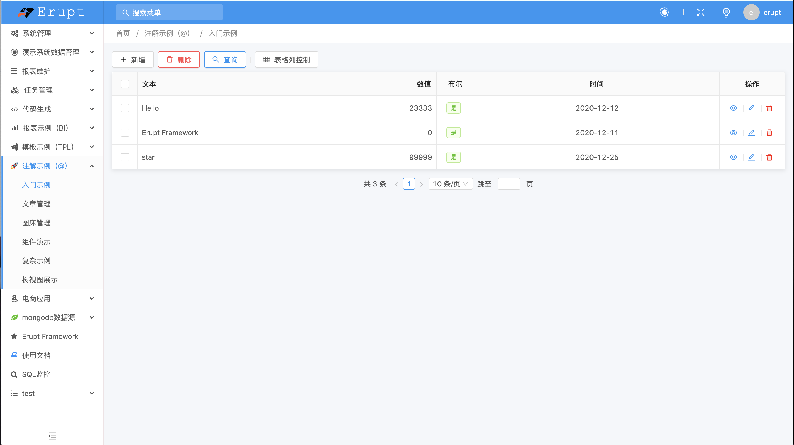

English &nbsp; | &nbsp; [中文](README-zh.md)

<p align="center"></p>

<h1 align="center">Low-Code + AI & 🦞</h1>

<h3 align="center">MDD & Annotation-driven development, zero front-end code, zero CRUD, multi-dimensional data management</h3>
<h3 align="center"><a href="https://erupt.xyz" target="_blank">https://www.erupt.xyz</a></h3>

---

<p align="center">
    <a href="https://mvnrepository.com/search?q=erupt"></a>
    <a href="./LICENSE"></a>
    <a href="https://github.com/erupts/erupt"></a>
    <a href="https://github.com/erupts/erupt"></a>
    <a href="https://gitcode.com/erupts/erupt"></a>
    <a href="https://gitee.com/erupt/erupt"></a>
    <a href="https://gitee.com/erupt/erupt"></a>
</p>

<p align="center">
    <a href="https://github.com/erupts/erupt">GitHub</a> &nbsp; | &nbsp;
    <a href="https://gitcode.com/erupts/erupt">GitCode</a> &nbsp; | &nbsp; 
    <a href="https://gitee.com/erupt/erupt">Gitee</a> &nbsp; | &nbsp; 
    <a href="https://www.erupt.xyz" target="_blank"><b>Official Website</b></a> &nbsp; | &nbsp; 
    <a href="https://www.erupt.xyz/#!/module" target="_blank">Ecosystem</a> &nbsp; | &nbsp;
    <a href="https://demo.erupt.xyz" target="_blank">Online Demo</a> &nbsp; | &nbsp; 
    <a href="https://docs.erupt.xyz" target="_blank">Documentation</a>
</p>


---

## 🚀 Low-code Development
> @Erupt annotation enables out-of-the-box functionality in all scenarios

- Visualization: Tables / Trees / Gantt Charts / Cards + 20+ form components
- Data: Full database compatibility, API data sources, automatic table/index creation, LambdaQuery multi-table queries, dynamic CRUD
- API: One-click OpenAPI exposure, row/column permission control
- Permissions: UPMS / Class / Row/Column / Role multi-dimensional management
- Extensions: i18n, Cloud clustering, audit & event logs, BI, SaaS, AI large models
- Form Reusability: Flow processes, custom nodes, custom buttons

## 🤖 AI Integration

> `erupt-ai` module — enterprise-grade LLM integration with zero boilerplate

### Supported LLM Providers

| Provider | Models |
|----------|--------|
| OpenAI / ChatGPT | GPT-4o and variants |
| Claude (Anthropic) | claude-3-7-sonnet and variants |
| Gemini (Google) | gemini-2.0-flash and variants |
| DeepSeek | deepseek-chat (thinking model support) |
| Qwen / GLM / Doubao | Alibaba · Zhipu · ByteDance |
| Moonshot / MiniMax | Kimi-K2.5 · MiniMax-M2.5 |
| Mistral / Grok | Mistral Large · Grok-2 |
| Fireworks / Together / OpenRouter | Open-source model hosting |
| Ollama | Local self-hosted models |

### Key Capabilities

- **Multi-Provider Switching** — configure multiple LLMs via UI, switch without code changes
- **Streaming Chat (SSE)** — real-time token-by-token responses with configurable timeouts
- **Thinking Models** — native support for reasoning models (DeepSeek, Kimi-K2)
- **MCP Protocol** — connect any MCP-compatible tool server (SSE & STDIO transports), with auto-reconnect health checks
- **AI Toolbox** — expose any Spring Bean as an AI tool via `@AiToolbox` + `@Tool` annotations
- **Agent Framework** — define agents with custom system prompts, hint lists, and dynamic prompt handlers
- **Chat History** — per-user conversation sessions with token tracking and soft-delete

LLM providers, MCP servers, and agents are all managed through the built-in admin UI — no restarts required.

## 🦞 Erupt AI Claw

> Drive your server through natural language — just like talking to a colleague

Erupt AI Claw lets you control annotation-driven data & business logic, execute shell commands, read/write files, and extend custom Skills — all through conversational AI.

### Claw Capabilities

- **Erupt Model Operations** — query, create, update data across any `@Erupt` entity via chat
- **Shell Execution** — run system commands directly through natural language
- **File I/O** — read and write files on the server
- **Browser Control** — interact with the browser via MCP configuration
- **Skills (700k+)** — compatible with 700k+ skills from [skills.sh](https://skills.sh); AI auto-matches and executes the right skill based on your prompt; supports dynamic skill creation
- **Long-term Memory** — cross-session memory persistence; AI automatically stores key decisions and context, reloaded on next session

> ⚠️ **Warning:** Claw has broad system permissions. Do NOT enable in production environments.

Skills are stored in `~/.erupt/skills/` and can also be created dynamically through chat.

---

## Low-code Quick Start

> 💡 **Run Locally**: Clone the repo and run `EruptSampleApplication.main()` in the `erupt-sample` module — no extra configuration needed, H2 in-memory database is bundled.
> Default credentials: `erupt / erupt`

#### Annotation Example

```java
@Erupt(
        name = "Simple",
        power = @Power(importable = true, export = true),
        @RowOperation(
                title = "Custom Action",
                mode = RowOperation.Mode.SINGLE,
                operationHandler = OperationHandlerImpl.class
        )
)
@Table(name = "t_simple")   //DB Table name
@Entity
public class Simple extends BaseModel {

    @EruptField(
            views = @View(title = "Text"),
            edit = @Edit(title = "Text", notNull = true, search = @Search)
    )
    private String input;

    @EruptField(
            views = @View(title = "Date"),
            edit = @Edit(title = "Date", search = @Search(vague = true))
    )
    private Date date;

    @EruptField(
            views = @View(title = "Slider"),
            edit = @Edit(title = "Slider", type = EditType.SLIDER, search = @Search,
                    sliderType = @SliderType(max = 90, markPoints = {0, 30, 60, 90}, dots = true))
    )
    private Integer slide;

    @EruptField(
            views = @View(title = "Choice Select"),
            edit = @Edit(
                    search = @Search,
                    title = "Choice Select", type = EditType.CHOICE,
                    choiceType = @ChoiceType(fetchHandler = SqlChoiceFetchHandler.class,
                            fetchHandlerParams = "select id,name from e_upms_menu"
                    )
            )
    )
    private Long choice;

}
```

#### JPA LambdaQuery

```java
public void select() {
    List<EruptUser> list = eruptDao.lambdaQuery(EruptUser.class)
            .like(EruptUser::getName, "e")
            .isNull(EruptUser::getWhiteIp)
            .in(EruptUser::getId, 1, 2, 3, 4)
            .ge(EruptUser::getCreateTime, "2023-01-01")
            .list();
}
```

[Feature Demo](https://www.erupt.xyz/#!/contrast)

## ⛰ Demo Screenshots

<table>
    <tr>
        <td></td>
        <td></td>
        <td></td>
    </tr>
    <tr>
        <td></td>
        <td></td>
        <td></td>
    </tr>
    <tr>
        <td></td>
        <td></td>
        <td></td>
    </tr>
</table>

## 🔌 Commercial Extension Modules

Beyond the open-source core, 4 enterprise-grade modules are available (source-code delivery · one-time purchase · no License/project-count/commercial restrictions):

| Module | Use Case | Documentation |
| --- | --- | --- |
| **Erupt Chart** | Reports & data visualization | [📖 Docs](https://docs.erupt.xyz/modules/pro/erupt-chart) |
| **Erupt Flow** | Workflow / approval engine | [📖 Docs](https://docs.erupt.xyz/modules/pro/erupt-flow) |
| **Erupt SaaS** | Multi-tenant infrastructure | [📖 Docs](https://docs.erupt.xyz/modules/pro/erupt-tenant) |
| **Erupt Cube** | BI platform with semantic layer | [📖 Docs](https://docs.erupt.xyz/modules/pro/erupt-cube) |

👉 **[See pricing and purchase process →](https://www.erupt.xyz/#!/pro)**

## 🔗 Download and Use

No need to compile source code. Simply add the following dependencies to your Spring Boot project:

```xml
<!--Core dependency-->
<dependency>
    <groupId>xyz.erupt</groupId>
    <artifactId>erupt-admin</artifactId>
    <version>${LATEST-VERSION}</version>
</dependency>
<!--Backend WEB interface-->
<dependency>
    <groupId>xyz.erupt</groupId>
    <artifactId>erupt-web</artifactId>
    <version>${LATEST-VERSION}</version>
</dependency>
```

> Latest Version
>
> <a href="https://mvnrepository.com/search?q=erupt"></a>

[Detailed Usage Steps](https://docs.erupt.xyz/guide/quick-start)

## 🌕 Online Demo

Demo URL: [https://demo.erupt.xyz](https://demo.erupt.xyz)

Username/Password: `guest / guest`

**Supports mainstream modern browsers and can run directly on Electron and other web-standard-based environments**

## 🔭 Open Source Recommendations

[`Linq.J`: Object query language based on JVM](https://github.com/erupts/Linq.J)

[`magic-api`: Rapid interface development framework](https://github.com/ssssssss-team/magic-api)

[`Jpom`: Lightweight low-invasive online build, automatic deployment, daily operations and maintenance, project monitoring software](https://gitee.com/dromara/Jpom)

## 🤝 Contributing

Erupt is a free and open-source project. We welcome anyone to contribute to Erupt to help improve it. This includes but is not limited to: submitting code, reporting bugs, sharing ideas, or sharing your use cases based on Erupt. We also welcome users to share Erupt on personal blogs or social media.

If you want to contribute code, please read our [Contribution Guidelines](./CONTRIBUTING.md) first.

Please submit [Issues](https://github.com/erupts/erupt/issues) and [Pull Requests](https://github.com/erupts/erupt/pulls) at https://github.com/erupts/erupt.

#### Thanks to the following contributors for their contributions to Erupt:

[](https://github.com/erupts/erupt/graphs/contributors)

## Star History

<a href="https://www.star-history.com/?repos=erupts%2Ferupt&type=date&legend=top-left">
 <picture>
   <source media="(prefers-color-scheme: dark)" srcset="https://api.star-history.com/image?repos=erupts/erupt&type=date&theme=dark&legend=top-left" />
   <source media="(prefers-color-scheme: light)" srcset="https://api.star-history.com/image?repos=erupts/erupt&type=date&legend=top-left" />
   
 </picture>
</a>

## License
⭐️ Erupt is under the Apache 2.0 license. See the [LICENSE](./LICENSE) file for details.

---

<p align="right">
Author: <a href="https://github.com/erupts">YuePeng</a> &nbsp; / &nbsp; <a href="mailto:erupts@126.com">erupts@126.com</a>
</p>
<br>
