## 插件简介

更人性化的自定义流程，可自定义表单，多种审批模式。

前端来自于另一个开源项目 <https://willianfu.github.io/wflow/>，感谢大佬。前端基于vue+elemntui开发，风格参考于钉钉的审批。

后端代码是基于erupt框架的自研流程引擎，设计思路基本上照搬acvititi。

- 演示地址：http://119.23.65.238:8080/
- 账号密码：erupt/erupt123（请勿修改密码！）

## 特点

- **人性化**

零技术的流程图绘制，不再像使用activiti或者flowable等，必须有专业知识。
普通用户也可以绘制流程和表单。

- **灵活**

流程可以分支、并行、多任务。
丰富的任务分配类型：用户、角色、多级连续审批等。
支持流程驳回、转办、终止等。

- **便捷**

基于erupt的插件，但不需要改任何代码，引入即用（甚至不需要建表）。
如需要使用自己的用户体系，实现几个简单的接口即可。

- **扩展**

可以对任何环节增加监听，以实现自己的逻辑。

## 截图


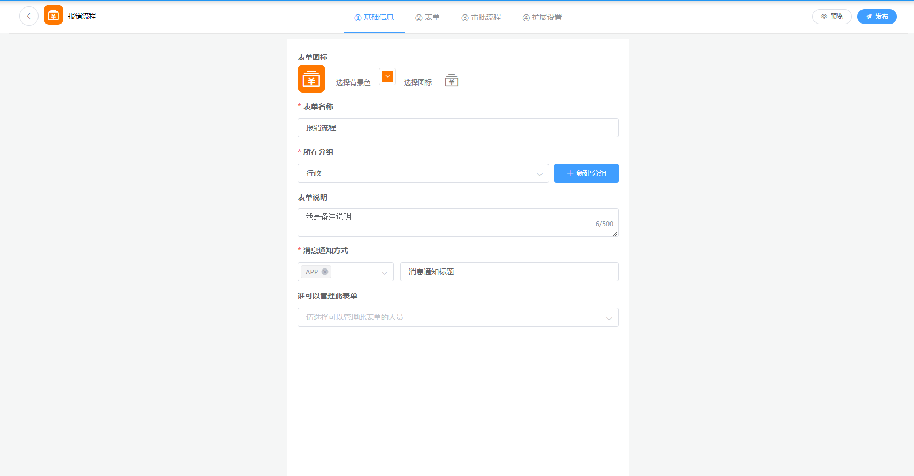

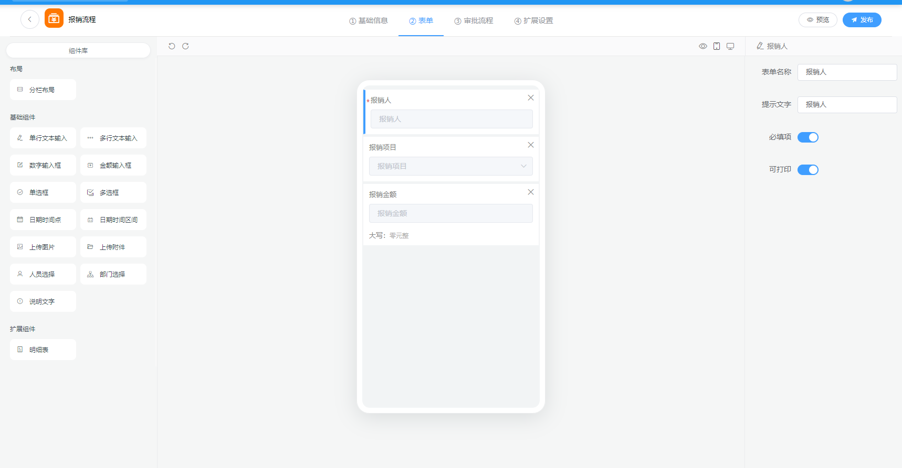

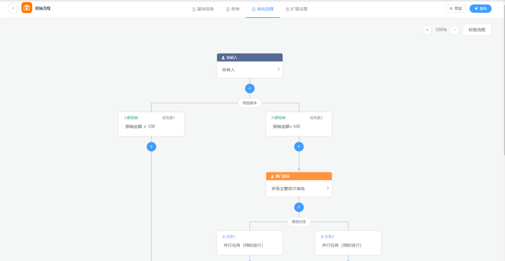


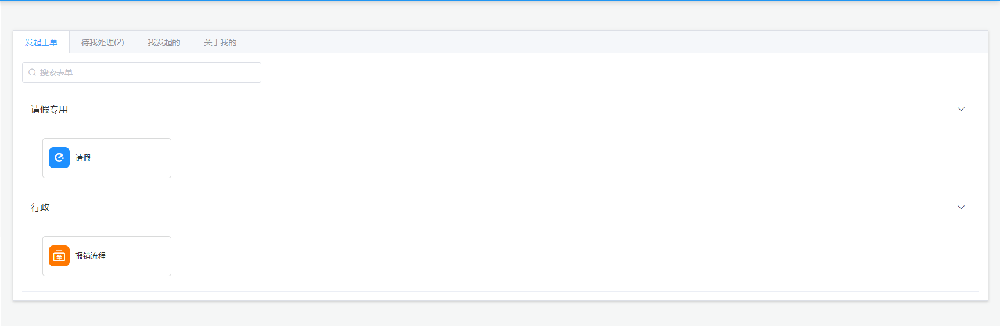

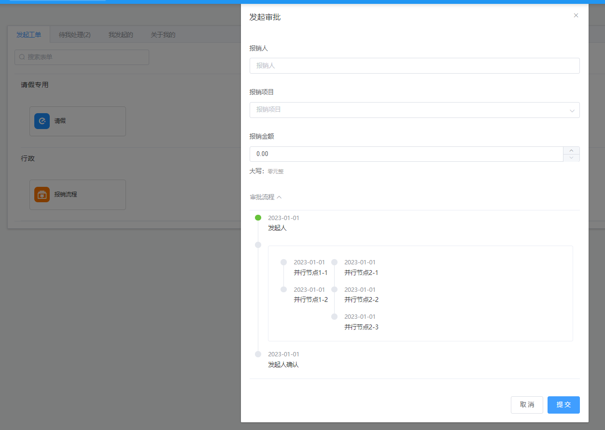


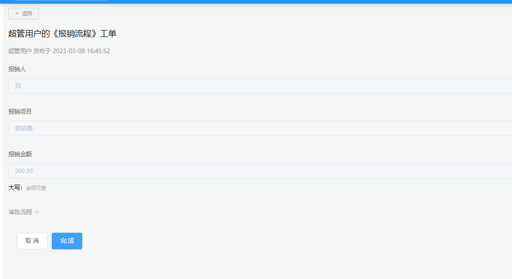

## 快速开始

**1. 引入pom**

与其他erupt插件一样

```xml
<dependency>
    <groupId>xyz.erupt</groupId>
    <artifactId>erupt-flow</artifactId>
    <version>${project.parent.version}</version>
</dependency>
```

**2. 分配菜单**

默认会添加2个菜单：

- 后台管理: 绘制流程图
- 工作区: 发起、处理工单

你也可以遵循erupt风格，创建任何你需要的菜单。`xyz.erupt.flow.bean.entity` 包下的类都可以。

## 项目结构

目录结构如下，前后端一体：

````
src   
 ├── console                                  // 前端代码          
 │    ├── api                                 // 调用后端接口
 │    └── views
 │         ├── common                         // 通用工具
 │         ├── admin                          // 管理端，流程图绘制，动态表单等
 │         └── workspace                      // 用户端，发起工单，审批工单等
 │
 ├── xyz.erupt.flow                           // 后端代码
 │       ├── bean                              
 │       ├── conf                             // 配置类，如：注册监听器链
 │       ├── constant                          
 │       ├── controller
 │       ├── process                          // 流程引擎核心代码
 │       │     ├─ builder                     // 
 │       │     ├─ engine                     
 │       │     ├─ listener                     
 │       │     └─ userlink                     
 │       ├── mapper
 │       ├── service
 │       ├── web                               // 对一些erupt的类进行增强
 │       └── EruptFlowAutoConfiguration.java   // 插件配置
 └── pom.xml                                   // 公共依赖

````

**前后端分离**

实际上console是一个独立的vue项目。

你可以把它build，然后将dist放在nginx中运行。

或者直接拷贝到你的前端项目中以实现前后端分离。

## 核心概念

了解这些概念帮助你快速上手。

- **节点 Node**

流程图中的基本元素，一个节点描述工单流转到此处时应该做什么。
流程图会以节点集合的形式（json格式）保存在数据库。


一个节点的结构例如：

```
{
	"id": "root",
	"desc": "任何人",
	"name": "发起人",
	"type": "ROOT",
	"props": {
		"formPerms": [],
		"assignedUser": []
	},
	"children": {
        ...
    }
```


- **流程定义 ProcessDefinition**

流程图发布之后产生流程定义，一经发布就不可改变。重复发布会产生新的版本。

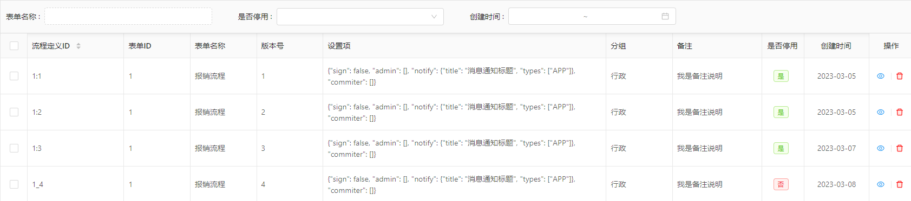


- **流程实例 ProcessInstance**

在某个流程定义下发起业务，会产生一个流程实例。一个流程定义可以产生多个流程实例。

一个流程实例也叫做一个工单。

> 流程定义与流程实例的关系，就像“类”与“对象”的关系。

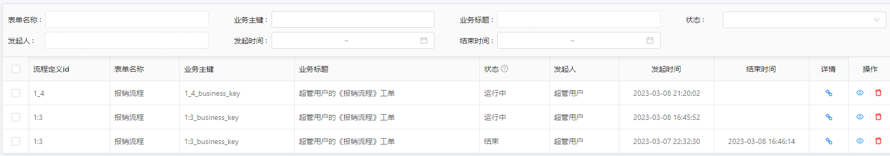


- **线程 Execution**

流程实例发起后会根据流程图进行流转，通常是单线程流转，即一个节点处理完再处理下一个。

当流程图中有分支时，会产生子线程，多个子线程可能会并行，但是此时主线程必须等待。

所有子线程结束后并入主线程，主线程继续。


- **活动 Activity**

流程实例进行到需要用户处理的节点时，会产生一个对应活动。

活动不能直接被用户完成，必须通过完成任务（Task）触发活动完成。

一个线程内同时只能有一个活动在运行。

> 以面向对象的思想来说，流程实例（ProcessInstance）是流程定义（ProcessDefinition）的实例化。
>
> 活动（Activity）就是节点（Node）的实例化。

- **任务 Task**

一个活动下可能会有多个任务，用户完成任务达到一定要求（如：完成所有任务、或者完成任意一个任务），会使得活动完成。

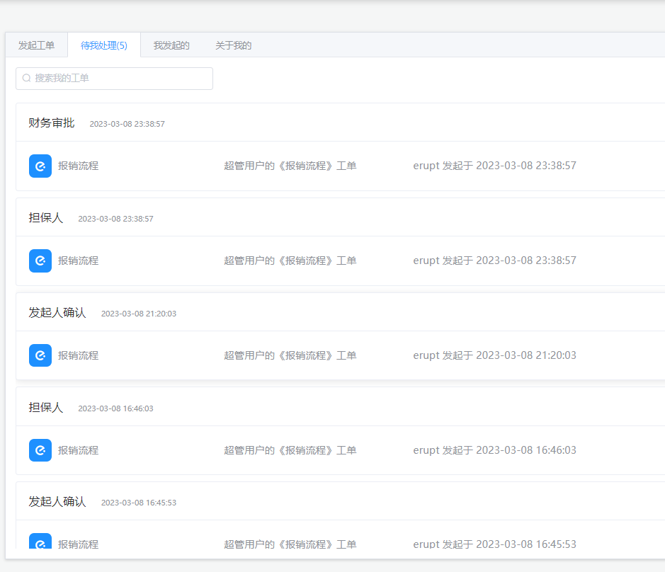

- **运行时（RUNNING）和历史（HISTORY）**

流程结束后，需要保留的数据，都会放入历史表（oa_hi_xxx）。

运行时表（oa_ru_xxx）中的数据将会删除，这是为了更高的效率。

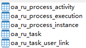 


## 修改用户体系

默认使用erupt的用户体系，有一些预设的地方，如：假定部门排序第一的人即是本部门管理员。这可能不符合你的需求。

你可以实现 ``xyz.erupt.flow.process.userlink.UserLinkService`` 接口，来改造用户体系。
但这要实现很多方法，继承默认的用户service `xyz.erupt.flow.process.userlink.impl.DefaultUserLinkServiceImpl` 是一个更好的选择。

```java
import org.springframework.stereotype.Service;
import xyz.erupt.flow.bean.vo.OrgTreeVo;

import java.util.ArrayList;
import java.util.List;

@Service
public class CustomUserLinkServiceImpl extends DefaultUserLinkServiceImpl {

    /**
     * 自定义的用户体系service要重写优先级，值要大于0
     * @return
     */
    @Override
    public int priority() {
        return 1;
    }


    /**
     * 针对某些方法进行改写
     * 返回指定部门的主管
     * @return
     */
    private List<OrgTreeVo> getLeadersByDeptId(Long deptId) {
        //直接没有部门主管
        return new ArrayList<>(0);
    }
}

```


## 添加监听

在各个实例、线程、活动、任务的启动、激活等时间点，程序会按顺序调用所有的监听器。你也可以实现适当的监听器，来扩展能力。

```java

import lombok.extern.slf4j.Slf4j;
import org.springframework.stereotype.Component;
import xyz.erupt.flow.bean.entity.OaTask;
import xyz.erupt.flow.process.listener.AfterCreateTaskListener;

/**
 * 监听器需要注册到spring
 */
@Component
@Slf4j
public class ConsoleListener implements AfterCreateTaskListener {
    @Override
    public void execute(OaTask task) {
        log.info("==> 有新任务{}", task.getId());
    }
}

```

可用的监听器都在`xyz.erupt.flow.process.listener`包下。

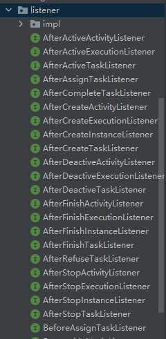

## 修改前端代码

如果你想修改前端，并且继续保持前后端一体部署，那么你需要：

1. 修改前端代码
2. build前端 `vue-cli-service build`，产生dist目录
3. build后端，自动将dist拷贝到最终的jar包中

重启程序，就可以看到修改之后的前端了。
